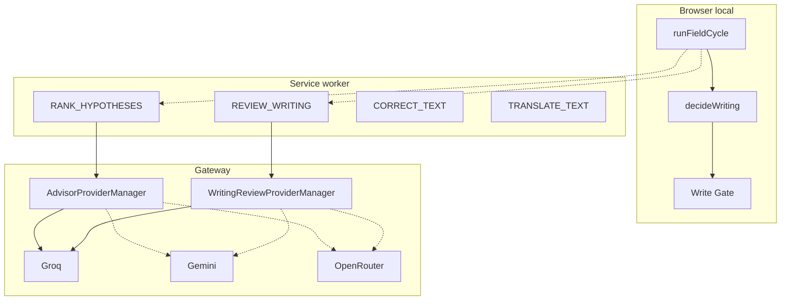

# AI architecture

LLMs are **reviewers and rankers**, not writers. They never mutate the DOM and never bypass Write Gate or `decideWriting`.

## Two writing-path LLM products

| | Hypothesis Advisor | Writing Review |
| --- | --- | --- |
| When | After local decision if `shouldConsultAdvisor` | After local fulfill, pause/sentence, `shouldScheduleWritingReview` |
| Packet | Hypothesis IDs + limited snippet | English **island** snippet + optional read-only context |
| Output | Ranked IDs, `ambiguityClass`, `reasonCode` | `verdict`, `edits[]` with offsets |
| May invent replacement? | **No** | Bounded `proposed` only; then ingest |
| Auto-write from late response? | **No** (suggestion only) | Only via new `decideWriting` + policy + live-text match |
| Fallback flag | `ADVISOR_FALLBACK_ENABLED` default **off** | `WRITING_REVIEW_FALLBACK_ENABLED` default **on** |
| Timeout | `advisorTimeoutMs` default 1500 | `writingReviewTimeoutMs` default 4500 |

Providers **disagreeing** does not matter: **first valid response wins**. No voting, no parallel calls.

## Other AI (not the decision engine)

| API | Use |
| --- | --- |
| `/api/ai/correction` | Speed Box / practice / website lab whole-range correction JSON |
| `/api/ai/translation` | Shortcut, session live fulfill, Speed Box |
| `/api/ai/layout-classification` | Optional CHECK_WORD (layout remains `mapLayout`) |
| `/api/ai/learning-coach`, `learning-report-narrate`, `explanation-localize` | Dashboard / explanations |

## When AI is skipped

Paste, composing, shortcuts_only, excluded site, password/sensitive, protected tokens, editorTier > 2, review cache hit, local unique layout already applied, Advisor off / Review off, no entitlement.

## When AI is unavailable

Local layout and instant English still run. Review/Advisor fail open to local decision. Typing must not block.

## Privacy

Advisor and review send **bounded snippets**, not the whole browsing session. Secrets/JWT/URL/email fields skip review. Gateway logs usage metadata, not a full writing archive. See [SAFETY.md](./SAFETY.md).

## Order

`AI_ADVISOR_PROVIDER_ORDER` / `ADVISOR_PROVIDER_ORDER`: default `groq,gemini,openrouter`. Same order for Writing Review.

Details: [../backend/PROVIDERS.md](../backend/PROVIDERS.md) · [WRITING_REVIEW.md](./WRITING_REVIEW.md)
