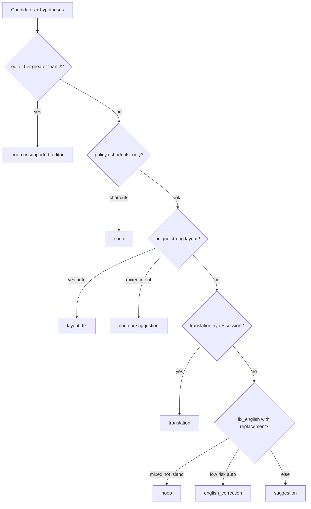

# Decision engine

File: `extension/src/core/engine/decide.ts`  
Function: `decideWriting(context, analysis, candidates, options) → WritingDecision`

A **decision** is not a hypothesis and not a write. It is one of: `layout_fix`, `english_correction`, `translation`, `suggestion`, `noop`.

## Distinctions

| Term | Meaning |
| --- | --- |
| Hypothesis | Span-level proposal with evidence, risk, optional replacement |
| Candidate | Action-shaped view of a hypothesis (`candidatesFromHypotheses`) |
| Decision | Single chosen action + reason codes + winner ids |
| Fulfillment | `fulfillWritingDecision` — suggestion UI or Write Gate |
| Write | `commitWriteTransaction` only |

## Invariants

- `noop` is success (intentional abstain), not a crash.
- Language detection is **evidence**, not intent.
- Advisor vote may reorder among **existing IDs** only. Invalid advisor → ignore.
- Late advisor apply: **suggestion only**.
- Strong overlapping layout beats English on the same span.
- Arabizi / ambiguous mixed / protected / open token → English auto-write forbidden.
- Translated English is not grammar-polished unless `polishAfterTranslate`.

## Failure

The function does not throw for normal uncertainty. It returns `noop` with reason codes (`ambiguous_mixed`, `stale` is a cycle outcome, not decide).

## Related

Hypothesis generation: [HYPOTHESIS_SYSTEM.md](./HYPOTHESIS_SYSTEM.md). Policy gates: [POLICY_AND_SETTINGS.md](./POLICY_AND_SETTINGS.md).
