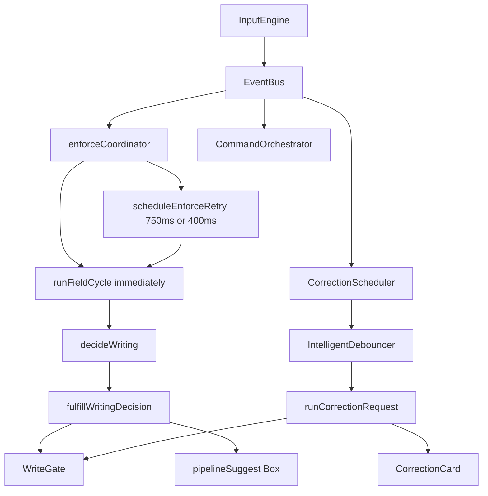
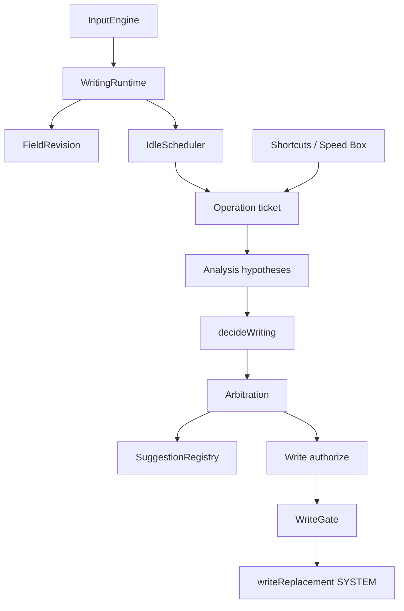

# Flowlary Writing Runtime Redesign

**Status:** design only. Not implemented. Code remains the source of truth for current behavior.

**Date:** 2026-09-04 (revised: revision authority, idle algorithm, commit-priority arbitration, Box identity, legacy-cycle cutoff, network coalescing, same-revision ops, external snapshot mismatch, composition-end)

This document is the architecture for a coherent writing lifecycle. It does not retune debounce numbers to hide races. It does not add ad-hoc `isBusy` flags. Implementation must wait for explicit review of this design.

Related current docs (describe *today’s* code; this file describes the *target*):

- [WRITING_ENGINE.md](./WRITING_ENGINE.md)
- [WRITE_GATE.md](./WRITE_GATE.md)
- [DECISION_ENGINE.md](./DECISION_ENGINE.md)
- [HYPOTHESIS_SYSTEM.md](./HYPOTHESIS_SYSTEM.md)
- [PHASE6_LIVE_TRANSLATION.md](./PHASE6_LIVE_TRANSLATION.md)
- [ARCHITECTURE_FREEZE.md](./ARCHITECTURE_FREEZE.md)

---

## Contents

1. [Current architecture](#1-current-architecture)
2. [Root causes](#2-root-causes)
3. [Proposed architecture](#3-proposed-architecture)
4. [Chosen design and why](#4-chosen-design-and-why)
5. [Operation and lifecycle model](#5-operation-and-lifecycle-model)
6. [Scheduling model](#6-scheduling-model)
7. [Cancellation model](#7-cancellation-model)
8. [Box state machine](#8-box-state-machine)
9. [WriteGate model](#9-writegate-model)
10. [Arbitration model](#10-arbitration-model)
11. [Direct and Box feature policies](#11-direct-and-box-feature-policies)
12. [Dashboard / Writing Lab](#12-dashboard--writing-lab)
13. [Failure and recovery](#13-failure-and-recovery)
14. [Invariants](#14-invariants)
15. [Instrumentation](#15-instrumentation)
16. [Migration phases](#16-migration-phases)
17. [Legacy immediate cycle](#17-legacy-immediate-cycle)
18. [Test plan](#18-test-plan)
19. [Files likely to change](#19-files-likely-to-change)
20. [Risks](#20-risks)
21. [Non-goals](#21-non-goals)

---

## 1. Current architecture

### 1.1 Capture

`InputEngine` (`extension/src/core/input/InputEngine.ts`) is the only document-level owner of writing events: `focusin`, `focusout`, `input`, `keydown`, `keyup`, composition. Feature modules must not attach competing global listeners.

On a normal user `input` event the engine:

1. Resolves the editable target and field safety.
2. `session.noteInput()` (timestamp used by pause gates).
3. `bumpUserGeneration()` unless composing, controlled write, or `insertReplacementText`.
4. Emits `{ type: 'input', origin: 'USER' | 'SYSTEM', generation }` on `EventBus`.

Controlled writes use `withWriteOrigin` (`extension/src/core/dom/write.ts`). Those events are `SYSTEM` and do not bump generation. Feature subscribers ignore `SYSTEM`.

Startup (`extension/src/content/startWritingRuntime.ts`): `InputEngine.start()`, then `startEnforceCoordinator`, then correction / layout / translation / orchestrator. Enforce runs before `CorrectionScheduler` on the same event.

### 1.2 Session, generation, mutex

`FieldSession` (`extension/src/core/session/FieldSession.ts`) holds:

- `generation` — user-intent clock (bumped on user input).
- Write mutex (`tryAcquireWrite` / `releaseWrite` / `abortActiveRequest`).
- `beginGenerationRequest` AbortControllers (advisor / review).
- Translated and corrected range tags, cooldown, composition, review pause timer.

`bumpGeneration()` increments generation, aborts the mutex, aborts generation-scoped fetches, clears cooldown, and clears the review timer.

These are three different mechanisms (generation, mutex, AbortController). None of them is a complete operation identity.

### 1.3 Parallel writers on the same input



**Enforce coordinator** (`extension/src/core/writeGate/enforceCoordinator.ts`):

- Calls `runFieldCycle` on **every** non-composing user `input`.
- Also on Space / Enter / Tab `keyup` and on `focus-out`.
- If live translation is on, resets a **750ms** retry (`LIVE_PAUSE_MS`).
- Else if Fix Typing is in suggestions mode, resets a **400ms** retry.
- `runIfEditable` is not queued. A previous cycle may still be `await`ing translation while a new cycle starts.

**Correction scheduler** (`extension/src/features/correction/scheduler.ts`):

- Independent `IntelligentDebouncer` (`extension/src/features/correction/debounce.ts`).
- Box delays: 120ms mid-word, 45ms after space, 30ms after sentence (`CORRECTION_DEFAULTS`).
- Direct live delays: 450 / 700 / 350 ms.
- Plus `LIVE_CORRECTION_MIN_INTERVAL_MS` (2500ms) extra before the next API.
- Local Box preview and Direct instant spell can run on the input path before debounce fires.

**Translation EventBus writer is retired.** `TranslationScheduler.start()` is a no-op. Live translation is enforce + `translationPauseReady` (`extension/src/features/translation/pauseGate.ts`).

**`liveSegmentOnPause`** (`extension/src/features/translation/segments.ts`) is **not a timer**. It chooses the sentence or paragraph to translate after the pause gate is already true.

**Layout auto-scheduler** `shouldRun` is always false. Layout auto-writes go through `runFieldCycle` only. Escape still closes Speed Box.

**CommandOrchestrator** takes the field mutex for shortcuts and bypasses `decideWriting` ranking.

### 1.4 Analysis and decision

`runFieldCycle` (`extension/src/core/writeGate/pipeline.ts`):

1. Builds `FieldContext` (including `translationPauseReady` from last-input timestamp).
2. Analyzes text, collects hypotheses, `decideWriting`.
3. May fire-and-forget advisor consult (`beginGenerationRequest`).
4. `fulfillWritingDecision` — WriteGate auto-write, pipeline Box, or translation API.
5. May schedule writing review (900ms pause) unless whole-field English owns correction.

`decideWriting` (`extension/src/core/engine/decide.ts`) evaluates layout, then translation, then English. That order is **implicit** (if-ladder), not a named priority table. Whole-field English is deferred from enforce when `isCorrectionSchedulerEligible()` (`extension/src/features/correction/liveAssist.ts`).

### 1.5 Box and WriteGate today

Page field mutations go through `commitWriteTransaction` → `writeReplacement`. Callers include pipeline fulfill, pipeline Box apply, translation executor, layout apply, merged English commit, Direct local English, Speed Box insert.

**Pipeline Box** (`extension/src/core/writeGate/pipelineSuggest.ts`): keep the card if `sourceText` is still findable as a substring; rewrite the record’s generation to the live one. Click locates the substring and acquires a **new** mutex at **current** generation. Old source inside newer text can still write.

**English Box** (`CorrectionCard` + `acceptCorrectionSuggestion`): can skip generation checks if the field still “matches”; API delivery can still `setReady` after debounce drift when `current.startsWith(requestedText)`. Tests encode apply-after-generation-bump as intended behavior.

**Box translation** often calls `translateFn` **without** mutex and with `getActiveRequest()?.signal` (usually undefined). Typing does not abort the HTTP call. Return path checks generation/text; UI/write should be stale, but the request still occupies the network and can overlap a later request.

**Dashboard compose** (`extension/src/dashboard/components/ComposeWorkbench.tsx`, `composeLiveAssist.ts`) is a second engine: React timers, `*RunRef` generation, `setInput` instead of WriteGate, different delays (1200ms mid-word correction, translation 900/1100ms). Website dashboard has no live compose runtime.

### 1.6 Product tools that must be preserved

| Tool | Live auto | Box | Direct | Shortcuts |
| --- | --- | --- | --- | --- |
| Fix Typing | enforce / decide layout | pipeline suggestion | auto WriteGate | CommandOrchestrator |
| Improve English | CorrectionScheduler + defer from enforce | CorrectionCard | local + API write | same |
| Arabic → English | 750ms pause + `liveTranslateSegment` | pipeline / translation card | `executeTranslation` | same |

Protected fields, composition, SYSTEM origin, and host-editor compatibility stay.

---

## 2. Root causes

Timing is not the bug. Identity, coalescing, and write authorization are.

### 2.1 No single freshness identity

Session generation, debounce generation, card `fieldGeneration`, pipeline suggestion generation, translation request keys, and compose `*RunRef` can disagree. A Box can become writable because old `sourceText` still appears inside the field.

A debounce is not a freshness mechanism. A mutex is not a lifecycle. A substring match is not an operation identity. An AbortController is not a guarantee the request stopped.

### 2.2 Per-keystroke cycles are unbounded

Immediate `runFieldCycle` on every `input` plus async `await` allows overlapping cycles. `bumpGeneration` **releases** the mutex, so the next cycle is not serialized. Continuous typing can start many analyses; slow translation can still be running when the next keystroke starts another.

### 2.3 Cancellation is incomplete

English remote correction uses the mutex AbortSignal. Box live translation often has no signal. Direct `executeTranslation` may acquire the mutex but pass `input.signal` (undefined) into `translate()`. HTTP that continues after invalidation must never be allowed to affect UI or the field; today that rule is enforced unevenly.

### 2.4 Scheduling is a federation

Independent wakes: English 120/45/30 or 450/700/350, Fix Typing 400ms retry, translation 750ms, writing review 900ms, English min-interval 2500ms, compose 1200/900/1100/280/360. All reset on input. There is no single meaning of “user stopped typing.”

### 2.5 Split ownership of English and Box UI

Enforce pipeline, CorrectionScheduler, pipelineSuggest, CorrectionCard, leftover feature cards, and compose React cards each have different stale rules. Two English owners (span vs whole-field) coordinate by deferral and mutex, not a shared queue.

### 2.6 WriteGate does not bind suggestion identity

WriteGate checks `cycleGeneration` and mutex for auto writes. Box click can mint a **new** lock at the current revision after locating old source. That is how a stale Box reaches the DOM.

---

## 3. Proposed architecture

One **Writing Runtime** per page (content script) owns:

- FieldRevision (user intent)
- Operation tickets (unit of work)
- IdleScheduler (the only auto wake)
- Cancellation (best-effort abort + mandatory staleness)
- Suggestion registry (Box)
- Write authorization (ticket before WriteGate)

Features remain **capabilities**: they produce analysis and replacements. They do not own document timers, generation, or competing EventBus auto-writers.



Layers stay distinct:

| Layer | May | Must not |
| --- | --- | --- |
| Input | Capture, origin, composition | Analyze, write |
| Revision | Invalidate old work | Start network |
| Schedule | Coalesce idle wakes | Mutate DOM |
| Operation | Own abort + snapshot | Bypass revision |
| Analysis | Hypotheses, local repair | Write, schedule |
| Decision | One action or noop | Network apply, DOM |
| Suggestion | Show Box bound to Operation | Write without revalidation |
| Write authorize | Mutex + ticket check | Invent a new revision for old Box |
| WriteGate | DOM mutation | Call providers |

---

## 4. Chosen design and why

### Option A — Central Writing Runtime / Operation Coordinator (chosen)

One coordinator owns identity, idle, cancellation, Box registry, and write authorization. Layout, translation, and English are plugins that run **inside** an Operation.

**Strengths:** one freshness story; bounded concurrency; Box cannot outlive its Operation; matches “do not add another parallel scheduler”; testable with fake clocks and revision assertions.

**Weaknesses:** larger migration; `enforceCoordinator` and `CorrectionScheduler` shrink to adapters; sticky-Box tests that encode apply-after-generation-bump must change.

**Concurrency:** feature analyses may overlap for the **same** FieldRevision when §10 allows. Direct write is serialized. Older revisions are permanently STALE.

### Option B — Feature schedulers plus shared tickets (rejected as end state)

Keep CorrectionScheduler, enforce retry, and compose timers; stamp tickets on results.

**Strengths:** smaller first diff.

**Weaknesses:** we already live in a weak Option B. Tickets miss a caller (`applyPipelineSuggestion`, compose `setInput`, Box translation without mutex) and the race remains. Three wakes still overlap.

**Role of B:** migration stepping stone only (introduce tickets on existing paths), not the target.

### Why A

The audit failures are cross-cutting (identity, overlap, Box click). A shared ticket type without a single scheduler leaves `runFieldCycle` on every keystroke. Option A removes that class of bug instead of decorating it.

**Freeze note:** [ARCHITECTURE_FREEZE.md](./ARCHITECTURE_FREEZE.md) says one InputEngine, one EventBus, one enforce coordinator, one `runFieldCycle`. The target keeps one InputEngine, one EventBus, one `decideWriting`, one WriteGate. Enforce coordinator becomes a thin adapter to WritingRuntime. Immediate `runFieldCycle` on every keystroke is the behavior being removed. CorrectionScheduler EventBus auto-correct is already listed as deprecated in the freeze; this design finishes that move.

---

## 5. Operation and lifecycle model

### 5.1 FieldRevision is the only freshness clock

**FieldRevision** is the authoritative freshness boundary. It is the session user-intent clock. Implementation may keep the existing `generation` field as the storage for FieldRevision (one integer, one bump site).

There is **no** second freshness generation. Forbidden as competing clocks:

- debounce generation
- card / suggestion generation
- operation generation
- pipeline suggestion generation rewritten on locate
- compose `*RunRef` used as a second truth beside session revision (compose may keep a local run id only as an alias of the latest compose snapshot)

`operationId` names a unit of work (logging, abort handle, WriteGate ticket). It does **not** make an old operation fresh. An operation whose captured revision is less than the session revision is **permanently STALE**, even if HTTP was not aborted, HTTP returned 200, `sourceText` is still a substring of the field, a new mutex can be acquired, or the card is still mounted.

| Event | Revision |
| --- | --- |
| Session create | 0 |
| USER `input` (not composing, not composition-commit `inputType`, not ignored types) | +1 |
| `composition-end` | +1 **once** for the committed composition (see §5.6) |
| Focus-out that commits an open token and changes text | +1 |
| SYSTEM write (WriteGate) | unchanged |
| `insertReplacementText` | unchanged |
| `compositionstart` / `compositionupdate` / `input` while composing | unchanged |
| `input` after `composition-end` with composition `inputType` | unchanged (must not double-bump) |

Bump is the single invalidate: every Operation with `capturedRevision < current` is permanently STALE. Do not re-stamp an old operation or suggestion with the new revision (that is today’s pipelineSuggest bug).

### 5.2 Operation

The unit of automatic or command work.

```text
operationId          identity only (not freshness)
fieldId
revision             copy of FieldRevision at creation  ← only freshness
feature              layout | translate | english | pipeline | shortcut
trigger              auto | shortcut | suggestion_accept | manual_box | focus_out
snapshotFullText
snapshotHash
abort                AbortController (best-effort)
state                pending | running | succeeded | superseded | failed
```

**Valid for UI or write only when** `operation.revision === session.revision` **and** `state` is not `superseded` / `failed`.

**Created when:** an IdleScheduler wake starts work for a feature; or immediately for shortcut / Speed Box / ticketed completed-token local Direct.

Identity for coalescing: `(fieldId, revision, feature, purpose)` where `purpose` is `auto-analysis` | `shortcut` | `focus-out` | `manual_box`. Duplicate keys must not start a second Operation.

### 5.6 Composition and FieldRevision (no double bump)

**Current InputEngine (today):** `input` while `session.isComposing() || isComposing()` does **not** bump (`ignoreGeneration`). `composition-end` **always** calls `bumpUserGeneration`. After `composition-end`, `isComposing()` is false, so a following `input` (`insertCompositionText` / `insertFromComposition`) **can bump again**. That double bump is a bug to close in the runtime, not a second clock.

**Intended sequence (target):**

| Event | Composing flag | FieldRevision | Scheduler |
| --- | --- | --- | --- |
| `compositionstart` | true | unchanged | no analysis; do not arm idle as USER commit |
| `compositionupdate` | true | unchanged | `noteInput` may update `lastInputAt`; no bump; no analysis |
| `input` during composition | true | unchanged | same |
| `compositionend` | false | **+1 once** | STALE older ops; `recompute` with committed text |
| Final `input` after end (`insertCompositionText`, `insertFromComposition`, `deleteByComposition`, `deleteCompositionText`) | false | **unchanged** | `noteInput` + `recompute` only if text/lastInputAt needed; **no** second bump |

Ordinary `insertText` after composition has finished (user types the next character) **does** bump.

Implementation: treat those composition `inputType`s like `shouldIgnoreInputForGeneration` **after** `composition-end`, **or** bump only on `composition-end` and skip bump on the trailing composition `input`. Exactly one +1 per committed composition.

During composition, IdleScheduler must not start auto analysis (same as today’s composing noop).

### 5.7 Operation coexistence (same field)

| Relation | Effect |
| --- | --- |
| Different **features**, **same** FieldRevision, arbitration allows | **May coexist** (e.g. English analysis + pending translation deadline). Do **not** supersede one because the other started. |
| Same `(field, revision, feature, purpose)` | **Coalesce** — do not create a second Operation; reuse or replace in place |
| `revision < session.revision` | **Permanently STALE**, regardless of abort |

§7 “Newer Operation same field → Previous superseded” applies only when the new Operation is a **duplicate key** or a **newer revision**, not when it is a different feature on the same revision.

### 5.3 Authoritative lifecycle

```text
USER INPUT
  → CAPTURE        InputEngine; origin USER vs SYSTEM
  → REVISION       FieldRevision++; older Operations permanently STALE
  → SCHEDULE       IdleScheduler: one timer, feature deadline table
  → OPERATION      capture revision + snapshot (operationId is not a clock)
  → ANALYSIS       hypotheses / local repair / optional network
  → VALIDATE       operation.revision === session.revision else STALE
  → ARBITRATE      commit priority LAYOUT > TRANSLATE > ENGLISH
  → EFFECT         Box | Direct request | noop
  → AUTHORIZE      revision + operationId + field + snapshot + range + state
  → WRITEGATE      commitWriteTransaction
  → COMMIT         SYSTEM origin; FieldRevision unchanged
```

Shortcuts skip IdleScheduler, create an Operation at current revision, then the same authorize → WriteGate path (`trigger: shortcut`). Speed Box uses `trigger: manual_box`.

### 5.4 Continuous typing (10 seconds, no pause)

Per `input`:

- Revision +1, previous Operations superseded, abort signals fired.
- IdleScheduler **replaces** the pending timeout (one timer per field).
- **No** new Operation starts.
- **No** `runFieldCycle` on the keystroke.

In-flight HTTP may still complete; the result is STALE (no UI, no write). Mutex released in `finally` and on revision bump.

After the user pauses, due features analyze for the **current** revision only.

### 5.5 Pause

**Pause** means: wall-clock quiet since `lastInputAt` for this field.

IdleScheduler is pause detection. Features declare **how long** they wait. `liveSegmentOnPause` only chooses **what** to translate after translation’s delay has elapsed (or focus-out bypass).

Do not treat debounce delay as proof of freshness. Freshness is revision + snapshot.

---

## 6. Scheduling model

### 6.1 One timer, many feature policies

IdleScheduler is the **only** `setTimeout` that may start auto analysis. Features **must not** own `setTimeout` / `IntelligentDebouncer` / `scheduleEnforceRetry`.

Feature policies are **pure functions**: given `{ text, mode, lastInputAt, lastEnglishNetworkAt, enabledTools }` they return a **deadline** (`dueAt`) or `null` (not eligible). They do not start timers.

Delays stay the current constants (not collapsed):

| Policy | `dueAt` |
| --- | --- |
| English Box | `lastInputAt +` 120ms mid-word, 45ms after space, 30ms after `.!?` / newline |
| English Direct | `lastInputAt +` 450 / 700 / 350 ms (same boundaries) |
| English network spacing | `max(englishDueAt, lastEnglishNetworkAt + 2500ms)` — rate limit only |
| Translation | `lastInputAt + 750ms` if live translation is on and the snapshot may contain Arabic; else `null`. Focus-out: `dueAt = now` (bypass) |
| Layout local fulfill | `lastInputAt +` the English delay for the current helpStyle/mode when a completed token may exist; incomplete tokens stay ineligible (open-token guards). Not a fourth delay table. |
| Writing review | `lastInputAt + 900ms` only if whole-field English does **not** own correction |

Compose delays stay out of the content-script scheduler until compose migration.

### 6.2 Algorithm (implement this, not independent feature timers)

Per field, the scheduler holds:

```text
revision          current FieldRevision
lastInputAt
snapshotText      text at last USER input
deadlines         Map<Feature, dueAt>   // computed, not timers
timer             one setTimeout | null
timerForDueAt     number | null
```

**`recompute(now)`** (on USER input, boundary-class keyup, or after a wake):

1. Cancel `timer` if set.
2. Rebuild `deadlines` from each enabled feature’s `policy.dueAt(...)`.
3. Let `next` be the minimum `dueAt` that is still in the future. If any deadline is already `<= now` (focus-out), run `onWake` immediately for those features.
4. If nothing remains, stop.
5. Arm **one** `setTimeout(onWake, next - now)` and store `timerForDueAt = next`.

**On USER input:** `lastInputAt = now`, FieldRevision++, older Operations permanently STALE, `snapshotText = live text`, `recompute(now)`. Do not start analysis on the keystroke.

**`onWake`:**

1. If the wake’s revision ≠ session revision, return.
2. `due =` features whose `deadlines <= now`.
3. For each due eligible feature, start or continue **analysis** tagged with this revision (§10 governs commit).
4. Drop those features from `deadlines`.
5. `recompute(now)` so the same timer waits for the next deadline (English at 120ms, then translation at 750ms).

English 120ms and translation 750ms are two **deadlines**, not two schedulers.

Keyup Space / Enter / Tab: `recompute` so word/sentence policies shorten deadlines for the **current** revision (if keyup did not already produce `input`).

Focus-out: set translation deadline to `now` if live translation is on; `recompute`. Not a second scheduler.

### 6.3 Bounds

| Resource | Bound |
| --- | --- |
| Pending `setTimeout` per field | 1 |
| Write mutex per field | 1 |
| Visible Box per field | 1 |
| In-flight Direct write per field | 1 |
| **Logical** live network per `(field, feature)` | 1 (the Operation whose result may Box/write) |
| **Physical** HTTP per `(field, feature)` | ≤ `MAX_PHYSICAL_HTTP` (3) including aborted-but-not-dead calls |

2500ms only delays **starting** a new English network call. It is not a freshness clock.

### 6.5 Network concurrency (AbortController is best-effort)

The runtime **cannot** guarantee “≤1 physical HTTP per field.” Older revisions may still have sockets open after `abort()`.

**Do not claim a physical ≤1 bound.** Claim these instead:

1. **Logical live ≤ 1 per (field, feature).** Only one Operation per feature is allowed to update Box or request WriteGate. Starting a new logical call for that feature marks the previous logical Operation `superseded` (same feature only).
2. **Do not start** a second logical call for the same `(field, revision, feature, auto-analysis)`.
3. **Physical cap:** count `physicalHttpInFlight[field][feature]` (increment on fetch start, decrement in `finally` even if aborted). If count ≥ `MAX_PHYSICAL_HTTP` (3), **do not dispatch** another request for that feature. Wait until a slot frees, then: if `session.revision` still matches the pending intent and the feature is still due, start at most one; otherwise drop. This bounds pause-type-pause bursts when abort does not stop HTTP.
4. **On FieldRevision +1:** abort all logical ops (best-effort); any later HTTP is STALE (revision check). Physical count still decrements in `finally` so the cap cannot stick at 3 forever (invariant D).
5. **Cross-feature:** English and translation may both have a logical live call on the **same** revision when §10 allows. Each feature has its own physical counter.

Invariant E: ≤1 idle timer; ≤1 logical live network **per feature**; physical HTTP **bounded by cap**, not by wishful abort.

### 6.4 What this replaces

Auto-owners to remove: `scheduleEnforceRetry`, CorrectionScheduler `IntelligentDebouncer.schedule`, `TranslationScheduler` timer, per-keystroke `runFieldCycle`. Delay math and `liveSegmentOnPause` may remain as **pure helpers**.

---

## 7. Cancellation model

Distinguish four ideas:

| Concept | Meaning |
| --- | --- |
| Cancellation | Best-effort `AbortController` on the Operation. HTTP may ignore it. |
| Staleness | Revision moved or operation superseded. Result must not affect UI or DOM. |
| Arbitration | Among **valid** results for the **same** revision, pick one feature. |
| Write authorization | Mutex + WriteGate + matching Operation + snapshot. |

### 7.1 What starts work

Idle wake, shortcut, Speed Box, or focus-out Operation.

### 7.2 What cancels / supersedes

| Event | Action |
| --- | --- |
| USER input (revision +1) | **All** Operations with older revision → permanently STALE; `abort.abort()`; reset IdleScheduler |
| New Operation, **same** `(field, revision, feature, purpose)` | Coalesce; previous duplicate `superseded` |
| New Operation, **same** field, **same** revision, **different** feature | Previous **not** superseded |
| New Operation, **newer** revision | All older-revision ops STALE |
| Snapshot mismatch (live ≠ operation snapshot), revision unchanged | That Operation `failed` (cannot write); see §7.6 |
| Focus-out | Pending auto wakes cancelled; optional focus-out Operation at **current** revision |
| Field disconnected / navigation | All superseded; Box hidden; mutex `finally`; physical counters released |
| User dismiss Box | Suggestion `DISMISSED`; Operation may complete without write |
| Shortcut acquires mutex | Auto **writes** blocked; do not STALE same-revision analysis unless mutex policy requires skip start |

### 7.3 HTTP that cannot be aborted

The response is STALE if the Operation’s revision ≠ session revision, or the Operation is `superseded` / `failed`. No Box. No WriteGate. Physical `finally` still decrements the cap (§6.5). Invariant G: failure to abort HTTP does not grant permission to use the result.

### 7.4 Signals that must be wired

Every network call inside an Operation uses `operation.abort.signal`:

- `requestCorrectionRemote`
- `translateFn` / `requestTranslationRemote` (including **Box** live translation)
- advisor consult
- writing review

`executeTranslation` must pass the Operation (or mutex) signal into `translate()`, not an optional undefined `input.signal`.

### 7.5 Mutex vs cancellation

Revision bump aborts and **clears** the mutex so the field is not stuck. Every acquire has `try` / `finally` release. Cooldown remains a WriteGate delay after a successful write, not a lifecycle lock. Invariant D: no permanent busy state.

### 7.6 External / host field changes without a USER revision bump

Hosts can change the field without a USER `input` that bumps FieldRevision: React/Gemini flicker, `insertReplacementText`, page scripts, IME edge cases, **SYSTEM WriteGate commits** (revision intentionally unchanged).

**Snapshot remains the write-safety check.** FieldRevision is not updated (no fake USER intent).

| Detection | Operation | Box | Schedule |
| --- | --- | --- | --- |
| `readFieldText() !== operation.snapshotFullText` | That Operation → `failed` (not a new revision). Cannot write. Mutex released if held. | HIDDEN (same as §8.3) | Not stuck: idle timer still owned; next USER input still bumps and schedules |
| SYSTEM write for this revision (e.g. layout Direct) | Lower-priority ops for this revision `failed`; do not keep using pre-write snapshots | Hide or replace per §10 | Do **not** bump revision. Do **not** immediately re-enter the same feature as USER input. Cooldown applies. Next USER keystroke is a new revision. |
| Host flicker, revision unchanged, text returns to snapshot | If Operation not yet `failed` and live equals snapshot again, Box may remain READY | Keep only if still READY and snapshot matches | No extra timer |
| Host flicker, text stays different | Operation `failed`; Box hidden | HIDDEN | **One** `recompute` with `snapshotText = live` **without** revision bump: start **new** `operationId`s for due features at the **same** FieldRevision capturing the new snapshot. Coalesce per feature. Caps in §6.5 still apply. |

Do not poll the DOM. Check snapshot on: idle wake, Box apply, WriteGate, and after SYSTEM commit. If mismatch is seen on wake, fail the old op and coalesce a replacement analysis for the current revision.

The runtime must not sit in PENDING/mutex forever after mismatch.

---

## 8. Box state machine

One **SuggestionRegistry** per field. Migration merges `pipelineSuggest`, `CorrectionCard`, and leftover feature cards onto this machine. UI chrome (`InlineSuggestionCard`) stays; identity moves to the registry.

### 8.1 States

```text
HIDDEN → PENDING → READY → APPLYING → HIDDEN
              ↘ ERROR → HIDDEN
READY → STALE → HIDDEN     (not writable)
READY → DISMISSED → HIDDEN
```

| State | Visible | Click writes |
| --- | --- | --- |
| HIDDEN | no | no |
| PENDING | loading | no |
| READY | yes | only if identity still valid |
| STALE | optional; **recommended hidden** | **never** |
| DISMISSED | no | no |
| APPLYING | yes | no (in flight) |
| ERROR | error chrome | no |

**On USER revision change:** `READY` → `HIDDEN`. Do not leave a clickable STALE card.

### 8.2 Binding (identity captured at create)

A READY suggestion stores **exactly** this contract (no extra generation fields):

```text
operationId          must match a live Operation record
revision             FieldRevision at create (must equal session.revision at apply)
fieldId
snapshotFullText     entire field text at create
snapshotHash
range                { start, end } into snapshotFullText
rangeText            snapshotFullText.slice(start, end)  // exact segment
replacement
action               layout | translation | english
state                READY | ...
```

Created only from a **valid** Operation (`operation.revision === session.revision` at create time).

### 8.3 Invalidation / replace / hide

| Event | Transition |
| --- | --- |
| Analysis starts | PENDING |
| Valid result | READY (replace) |
| USER FieldRevision +1 | HIDDEN (required, not optional STALE-clickable) |
| `readFieldText() !== snapshotFullText` | HIDDEN |
| Dismiss | DISMISSED |
| Apply success / reject | HIDDEN |
| Empty field (user deleted) | HIDDEN |
| Focus-out teardown | HIDDEN |
| Safety block | HIDDEN |

Host empty-field flicker: if revision did **not** bump (SYSTEM / ignored `insertReplacementText`), keep READY. If USER input emptied the field, revision bumped and the Box hides. A 700ms flicker exception, if kept, **must not** allow click while `live !== snapshotFullText`.

### 8.4 Apply authorization (before WriteGate)

Click / apply must pass **all** of these. Failure → reject, hide, no mutex mint for a new revision, no WriteGate commit.

1. **Suggestion state** is `READY` (not PENDING, STALE, DISMISSED, ERROR, APPLYING).
2. **Field identity:** the target element still maps to `fieldId` and is connected.
3. **Revision:** `suggestion.revision === session.revision`.
4. **Operation identity:** `suggestion.operationId` exists, `operation.revision === suggestion.revision`, `operation.state` is not `superseded` / `failed`.
5. **Snapshot:** `readFieldText(element) === suggestion.snapshotFullText` (exact string).
6. **Range/segment:** `live.slice(range.start, range.end) === suggestion.rangeText`.
7. Then acquire mutex for **this** operation and call WriteGate with `operationId` + `revision`.

**Forbidden:** `indexOf(sourceText)` / `locateSource` as authorization. Offset repair is allowed only after (5) and (6) already passed (equivalent folded characters **within the same snapshotFullText**).

**Rejected scenario:**

```text
Analyzed snapshotFullText:  "hello"
rangeText:                  "hello"
replacement:                "Hello"

Current field:              "hello world"
```

Even if `"hello"` is still found at index 0, apply is rejected: FieldRevision has changed **or** `snapshotFullText !== live` (`"hello" !== "hello world"`). The old Box is not authorized.

English `acceptCorrectionSuggestion` must use this contract. Tests that apply after revision bump must be rewritten.

---

## 9. WriteGate model

WriteGate remains the only page-field mutator (`extension/src/core/writeGate/writeGate.ts` → `writeReplacement`). Decision, advisor, and review never touch the DOM.

### 9.1 Required authorization (target)

Before mutation:

1. Field still connected and matches `fieldId`.
2. `operationId` present and known; `operation.revision === session.revision`.
3. Operation not superseded.
4. Mutex held for this requestId.
5. `readFieldText() === snapshotFullText` and range slice equals `rangeText` (Box/Direct span writes).
6. Origin / trigger / policy / shadow / cooldown as today.

Box click cannot bypass 2–5 by acquiring a fresh mutex or by substring locate.

During migration, `operationId` may be optional behind a flag, then required.

### 9.2 SYSTEM writes and feedback loops

Successful writes use `withWriteOrigin`. InputEngine does not bump revision. IdleScheduler ignores SYSTEM. Invariant I.

If a host later emits a USER `input` for the same change, revision **does** bump (host compatibility). That supersedes leftover auto work. It must not re-enter an infinite write loop: the new Operation sees already-corrected/translated tags and should noop.

### 9.3 Callers that must pass tickets

`fulfillWritingDecision`, `applyPipelineSuggestion`, `fulfillTranslationDecision` / `executeTranslation`, `writeExplicitEnglishSpan`, `applyLayoutFix`, layout/translation feature card apply, `commitMergedCorrection`, `writeDirectLocalEnglish`, Speed Box `insertResult`.

No new `element.value =` / `execCommand` outside `extension/src/core/dom/write.ts`.

Dashboard compose is not WriteGate; it must not mutate host page fields.

---

## 10. Arbitration model

Chosen model: **B — commit / display priority**, not **A — sequential wait**.

LAYOUT → TRANSLATION → ENGLISH is the order in which a **valid** result may **commit** (Direct) or **occupy the Box**. It is **not** “English HTTP must wait until translation HTTP finishes, which must wait until layout HTTP finishes.”

`decideWriting` remains the chooser among **already-available** local candidates. Network features start when their IdleScheduler deadline fires (§6).

### 10.1 Hard gates (noop)

Assistant off, `shortcuts_only`, unsafe field, composing, mutex held by a **shortcut** Operation, unsupported editor, bulk paste/drop, `user_override` on the colliding span.

### 10.2 When parallel analysis is allowed

Same FieldRevision, user has not typed:

| Allowed | Why |
| --- | --- |
| Local layout analysis as soon as layout’s deadline fires | Avoid Fix Typing latency |
| English local repair / Box preview when English deadline fires, if translation is **ineligible** (`dueAt` null) | No higher-priority network pending |
| English **network** when English deadline fires **and** translation is ineligible | Same |
| Translation network when 750ms (or focus-out) fires | Independent of English if English has not Direct-written |
| Advisor/review on the same revision abort, suggestion-only if late | Existing freeze |

### 10.3 When parallel analysis is forbidden

| Forbidden | Why |
| --- | --- |
| Any analysis for `revision < session.revision` | Permanently STALE |
| Starting work after a **higher-priority Direct write** has committed for this revision | Field already changed (SYSTEM); wait for next USER revision |
| Two Direct writes in flight | One write mutex |
| English **Direct commit** while translation is still **eligible and not resolved** for this revision (deadline in the future or request in flight) | Would destroy Arabic before translation; translation outranks English |
| English **network start** while a **layout Direct** is in flight | Layout outranks |
| Stacking a second English or translation HTTP for the same revision | Coalesce |

**Pending higher-priority work blocks lower-priority COMMIT, not always analysis.**

- Layout may Direct-write when its local result wins (highest rank). That **cancels** pending translation/English for this revision.
- Translation may run at 750ms even if an English Box is already READY; if translation returns valid, it **replaces** the English Box (higher rank) provided revision still matches.
- English may analyze at 120ms when translation is ineligible. If translation is eligible, English may do **local Box preview** only if product needs it, but **must not Direct-write** until translation is ineligible, completed-noop, or this revision is superseded. Prefer: no English Direct until translation resolved.

### 10.4 Priority table (commit / Box occupancy)

| Rank | Capability | When it wins | Blocks |
| --- | --- | --- | --- |
| 1 | Fix Typing | Unique strong layout (existing decide rules) | Translation and English commit/Box for that span |
| 2 | Arabic → English | Live/shortcut on, deadline elapsed or focus-out, `liveTranslateSegment` non-null | English commit unless `polishAfterTranslate` on tagged ranges |
| 3 | Improve English | Eligible; local and/or CORRECT_TEXT | — |

Existing decide details stay (arabizi, protected tokens, mixed spans). Whole-field vs span English: same FieldRevision; no debounce generation.

### 10.5 Translated and corrected ranges

Successful translate writes tag translated ranges. English skips overlap unless polish. Corrected ranges suppress covering layout as today. SYSTEM translate/correct does not bump FieldRevision.

### 10.6 Advisor, review, shortcuts

Advisor/review: same revision abort; late result suggestion-only. Shortcuts take write mutex first; auto scheduler does not start or is superseded.

---

## 11. Direct and Box feature policies

All three tools use WritingRuntime. Delays stay as in §6.2.

### 11.1 Fix Typing

- **Trigger:** Idle Operation; completed-token local layout may fulfill at word boundary.
- **Local repair:** `mapLayout` / layout spans in analysis.
- **AI fallback:** classifier only inside the Operation if local insufficient (today’s remote path, not a second scheduler).
- **Box / Direct / Shortcuts:** `helpStyle` as today.
- **Cancellation / stale:** revision supersede; WriteGate ticket.
- **Priority:** 1.

### 11.2 Improve English

- **Local repair:** may PENDING/READY Box at English idle; Direct instant spell on word boundary remains a ticketed local write (existing `writeDirectLocalEnglish`), not a peer timer.
- **API:** `CORRECT_TEXT` on the same Operation; 2500ms rate limit on **start**.
- **Whole-field:** `extractWritingContext` unchanged.
- **Box / Direct / Shortcuts:** correction.mode and helpStyle as today.
- **Pause:** English policy delay via IdleScheduler, not 750ms translation pause.
- **Stale:** API after revision change cannot `setReady` or Direct-write.

### 11.3 Arabic → English

- **Segment:** `liveTranslateSegment` / `liveSegmentOnPause` after pause or focus-out.
- **Live:** IdleScheduler 750ms, not per keystroke.
- **Box / Direct:** `translation.mode`; fetch uses Operation.abort. Logical live ≤1 per feature (§6.5). Write mutex only when committing, so shortcuts are not blocked by a Box-only fetch.
- **Translated ranges:** clip as today.
- **Stale:** translation A returning after B cannot Box or write.

### 11.4 Direct timeline

```text
input → schedule → idle → Operation → analysis → validate revision
  → arbitration → acquire mutex → WriteGate → commit
```

| User types | Effect |
| --- | --- |
| Before analysis starts | Wake replaced; no Operation |
| During analysis / API | Superseded; abort; STALE result |
| After result, before write | Validate fails; no write |
| During WriteGate | Mutex; USER input aborts; write rejects stale |
| Immediately after SYSTEM commit | Cooldown; no revision bump; next USER key starts new revision |

### 11.5 Box timeline

```text
input → schedule → idle → Operation → validate → READY Box
  → user types → revision +1 → Box hidden
  → click (if still READY) → revalidate identity → WriteGate → commit
```

Click never trusts “source still in field.” Apply uses §8.4.

---

## 12. Dashboard / Writing Lab

Extension **Writing Lab / Compose** duplicates lifecycle in React (`ComposeWorkbench` timers, `correctionRunRef` / `translationRunRef` / `layoutRunRef`, `setInput`). It does not use InputEngine, FieldSession, or WriteGate. Website dashboard has no live compose engine. Website Writing Lab stays button-triggered.

**Do not** mount InputEngine in the dashboard.

**Do** share TypeScript contracts from `extension/src/core/runtime/` (FieldRevision analogue = run id, Operation, idle policy helpers). Compose may apply `setInput` only when `runId === latest`. Do not unify compose delay numbers in the first content-script migration.

`@flowlary/shared` keeps constants (`CORRECTION_DEFAULTS`, `LIVE_PAUSE_MS` if lifted), not the coordinator.

---

## 13. Failure and recovery

| Failure | Runtime |
| --- | --- |
| API timeout / AbortError | Operation `failed` or `superseded`; no write; Box ERROR or HIDDEN |
| Malformed response | `failed`; treat as noop |
| Stale response | ignore |
| Field removed / iframe gone | teardown; supersede; hide Box |
| Focus lost | focus-out Operation or cancel pending |
| Navigation / extension reload | new sessions; nothing sticky |
| Mutex acquire fail | `busy`; retry only via next idle or user shortcut, never spin |
| WriteGate rejection | Operation `failed`; field unchanged; next input schedules |
| Unexpected exception | catch at Operation boundary; release mutex; IdleScheduler still armed |
| Live text ≠ snapshot, revision unchanged | Operation `failed`; Box hidden; optional same-revision re-analysis (§7.6) |

A single failed async path must not disable WritingRuntime (invariant J).

---

## 14. Invariants

**A — No stale writes.** No superseded Operation mutates the field.

**B — Latest user intent wins.** A newer FieldRevision supersedes older automatic work unless an explicit policy says otherwise (none for auto writes).

**C — WriteGate is authoritative.** All page-field mutation uses `commitWriteTransaction` with an Operation ticket (after the required-ticket step).

**D — No permanent busy state.** Mutex and Operation always finalize (`finally` + revision abort).

**E — Bounded concurrency.** ≤1 idle timer per field. ≤1 **logical** live network per `(field, feature)`. Physical HTTP per feature ≤ `MAX_PHYSICAL_HTTP` (3), including aborted-but-still-open requests. No unbounded cycle starts.

**F — Stale UI cannot apply.** A visible Box that is STALE, or any click whose revision/snapshot fails, never writes.

**G — Cancellation is best-effort.** HTTP that continues is STALE.

**H — User input has priority.** USER origin supersedes automatic work.

**I — SYSTEM writes do not create feedback loops.** Controlled writes do not bump revision or schedule as USER.

**J — Feature isolation.** One feature `failed` does not stop IdleScheduler or other tools.

**K — One idle owner per field.** No peer `setTimeout` that calls `runFieldCycle` or `runCorrectionRequest`.

**L — Snapshot identity.** Writes require snapshot match; locate-by-substring cannot authorize. Snapshot mismatch without a revision bump fails the Operation (§7.6); it does not invent a second freshness clock.

**M — Logical network coalescing.** At most one result per `(field, feature)` may affect UI/write. Duplicate `(field, revision, feature, purpose)` does not start a second call. Older revisions are STALE even if their HTTP is still physically in flight. Physical count is capped (§6.5), not assumed to be 1.

---

## 15. Instrumentation

Development-only (flag: `localStorage` / `flowlary.runtimeTrace`, off in production builds by default). No raw field text in logs.

Example:

```text
INPUT revision=42
SCHEDULE operation=43 due=750ms
START operation=43 feature=TRANSLATE
INPUT revision=44
INVALIDATE operation=43
SCHEDULE operation=45
RESULT operation=43 STALE
START operation=45
RESULT operation=45 VALID
BOX operation=45 READY
CLICK operation=45
WRITEGATE operation=45 ACCEPT
COMMIT operation=45
MUTEX acquire/release
```

Use this to diagnose overlap, cancellation, Box, mutex, and WriteGate. Reuse existing analytics event names where possible without logging user content.

---

## 16. Migration phases

Incremental. After each step: unit tests, `tsc`/build, relevant e2e, inspect diff. Do not delete old lifecycle code until WritingRuntime is authoritative (§17).

| Step | Components | Behavior change | Risk | Tests | Rollback |
| --- | --- | --- | --- | --- | --- |
| 1 Primitives | `FieldSession`, `Operation.ts` | FieldRevision **is** session generation; Operation captures it; no new clocks | Low | session unit | revert types |
| 2 Identity on writes | `writeGate.ts` | Optional then required `operationId` + revision | Medium | writeGate tests | flag |
| 3 Cancellation | executor, applyCorrection, pipeline translate | Abort signal on every HTTP | Low | race tests | revert signals |
| 4 IdleScheduler | WritingRuntime, enforceCoordinator | **New path authoritative**; immediate cycle behind flag only | High | §17 + phase6 + debounce | `legacyImmediateCycle` |
| 5 Layout | pipeline fulfill | Ticketed layout | Medium | scenario-classes | flag |
| 6 English | CorrectionScheduler → capability | No peer IntelligentDebouncer timer | High | correction unit/e2e | flag |
| 7 Translation | Box uses Operation abort | No overlapping translate HTTP for old revision | Medium | n2 + phase6 | flag |
| 8 Box registry | pipelineSuggest, CorrectionCard | §8.4 apply contract; hide on revision | High | sticky tests rewritten | — |
| 9 WriteGate required ticket | all callers | Compile-time | Medium | write tests | — |
| 10 Compose | ComposeWorkbench | Apply only if run id = latest | Medium | composeLiveAssist | — |
| 11 Delete legacy | §17 | Remove immediate cycle and dead timers | Medium | grep + §17 tests | — |
| 12 Stress | new tests | Rapid typing, hello/hello world | — | §18 | — |

Rewrite, do not preserve: `pipeline-suggestion-sticky.test.ts`, `applyCorrection.test.ts` apply-after-debounce-bump.

---

## 17. Legacy immediate cycle

The old per-keystroke `runFieldCycle` (and `scheduleEnforceRetry` as a second cycle) may exist **only** as a migration escape hatch. It must not remain a second lifecycle owner.

### 17.1 How it is disabled

Flag: `legacyImmediateCycle` (dev/test only; default **false** once IdleScheduler ships in step 4).

When **false** (target): `enforceCoordinator` on USER `input` must **not** call `runFieldCycle`. It only forwards to WritingRuntime (`noteInput` already happened in InputEngine; runtime `recompute`s). Keyup Space/Enter/Tab only `recompute`s deadlines, and does not start a parallel cycle. Focus-out goes through IdleScheduler (translation `dueAt = now`), not a raw `runFieldCycle` that ignores revision.

When **true** (rollback only): old `runIfEditable` + `scheduleEnforceRetry` run. Shipping builds must not leave this true.

### 17.2 When the new runtime is authoritative

After step 4 lands with the flag **false** in production:

- IdleScheduler is the only auto wake.
- Every auto analysis/write carries `operation.revision === session.revision`.
- `runFieldCycle` may still exist as the **analysis/fulfill function** invoked **from** WritingRuntime on a wake (rename later to `runOperationAnalysis`). It is not an EventBus lifecycle owner.

### 17.3 Tests that prove the old path is inactive

Required before deleting legacy:

1. Spy: USER `input` does not call `runFieldCycle` / `runIfEditable` synchronously (fake timers: 0ms → 0 cycles).
2. After English Box delay, exactly one analysis for that revision.
3. After 749ms with live translation, 0 translation HTTP; at 750ms, 1.
4. Continuous keystrokes reset the single timer; `setTimeout` count per field stays 1.
5. `legacyImmediateCycle === true` is not set in default `startWritingRuntime`.
6. Grep CI (step 11): no `scheduleEnforceRetry` from the input handler; no `IntelligentDebouncer.schedule` from CorrectionScheduler `onInput`.

### 17.4 When the old path is deleted

After: flag unused, tests in §17.3 green, e2e three-tools / phase6 / native-english green with idle waits, no production caller of `scheduleEnforceRetry`.

Then delete: the flag, `scheduleEnforceRetry`, enforce input → `void runIfEditable`, CorrectionScheduler EventBus debounce arming, `TranslationScheduler` timer methods, LayoutScheduler `evaluate` dead auto path.

**Keep:** `runFieldCycle` (or renamed) as the analysis engine; `decideWriting`; `liveSegmentOnPause`; `getDebounceDelay` as a **pure** policy helper; WriteGate; InputEngine.

### 17.5 Obsolete after migration

| Obsolete as lifecycle owner | Survives as |
| --- | --- |
| Immediate `runFieldCycle` on every `input` | Analysis called from IdleScheduler |
| `scheduleEnforceRetry` | — |
| `IntelligentDebouncer` generation + timer | `getDebounceDelay` / boundary helpers |
| Debouncer generation on cards | FieldRevision on the suggestion |
| pipelineSuggest `current.generation = session.getGeneration()` on locate | Forbidden re-stamp |
| `beginGenerationRequest` as a second abort set | Operation.abort |
| `TranslationScheduler.schedule` | — |

---

## 18. Test plan

Deterministic tests with fake timers.

| Case | Assert |
| --- | --- |
| Rapid A,B,C,D | Only latest revision may write; earlier Operations STALE even if HTTP 200 |
| Continuous typing | 0 analyses during typing; 1 timer; after idle, current revision only |
| One timer, two deadlines | English analysis at 120ms; translation HTTP only at 750ms; still one `setTimeout` handle |
| API A then type then B then A returns | A no Box, no write |
| Box A, type, click A | Reject |
| `"hello"` Box, field `"hello world"` | Reject even if `"hello"` is a prefix |
| Translation A/B race | A cannot UI or write |
| Direct after extra USER input | No overwrite |
| SYSTEM write | No USER schedule |
| `legacyImmediateCycle` false | No sync `runFieldCycle` on input |
| Physical HTTP cap | After 3 un-finished English fetches (abort ignored), a 4th is not started until `finally` frees a slot |
| Same-revision layout + translation | Starting translation analysis does not STALE English analysis on the same revision |
| Duplicate english auto-analysis same revision | Coalesced; one logical live |
| Composition: start, updates, inputs, end, trailing `insertCompositionText` | FieldRevision increases **exactly once** |
| Host changes text, no USER bump | Write rejected; Box hidden; mutex free; optional same-revision re-analysis; next USER input still works |
| Failure recovery | Next USER input still schedules |

---

## 19. Files likely to change

**New (implementation later):** `extension/src/core/runtime/{WritingRuntime,IdleScheduler,Operation,SuggestionRegistry}.ts`, `docs/architecture/FLOWLARY_WRITING_RUNTIME_FINAL_AUDIT.md`.

**Rewire:** `enforceCoordinator.ts`, `pipeline.ts`, `pipelineSuggest.ts`, `pipelineTranslate.ts`, `writeGate.ts`, `FieldSession.ts`, `executor.ts`, correction `scheduler.ts` / `applyCorrection.ts`, `startWritingRuntime.ts`, `ComposeWorkbench.tsx`.

**This design revision does not change production files.**

---

## 20. Risks

1. Fix Typing feel — use layout deadline = English word-boundary delay, not per-keystroke cycles.
2. Host flicker — hide on revision; no substring-apply.
3. Compose delays — do not unify in the first content-script migration.
4. English Direct vs pending translation — §10.3: do not Direct English while translation is still eligible.
5. Sticky tests encode the bug — rewrite them.
6. E2E must wait for policy delays, not immediate cycles.
7. Update ARCHITECTURE_FREEZE after implementation: one WritingRuntime, not immediate `runFieldCycle`.

---

## 21. Non-goals

This redesign is **not** a rewrite of feature intelligence.

It does **not** aim to:

- Replace working Fix Typing / `mapLayout` / layout hypothesis quality
- Replace English local repair, `CORRECT_TEXT` prompt contract, or `extractWritingContext`
- Replace translation providers, `liveTranslateSegment`, or polish-after-translate rules
- Invent new product tools or collapse Direct / Box / Shortcuts
- Retune delay numbers to hide races
- Mount InputEngine in the dashboard
- Add `isBusy` / `ignoreNext` flags outside Operation state
- Keep two lifecycle owners (`legacyImmediateCycle` is temporary only)

**Goals:** lifecycle, scheduling, concurrency, freshness (FieldRevision), arbitration (commit priority), Box authorization, WriteGate integration.

```text
User types
  → FieldRevision++
  → Older Operations permanently STALE
  → One IdleScheduler timer; feature policies set deadlines
  → Due features analyze (parallel when §10 allows)
  → Only highest-authority valid result may Box/Direct
  → Apply/write checks revision + operation + field + snapshot + range + state
  → WriteGate commits SYSTEM
```

---

## Deliverable checklist (this revision)

1. FieldRevision is the only freshness clock — §5.1  
2. One timer, feature deadline table — §6.2  
3. Arbitration B (commit priority) — §10  
4. Box identity + `"hello"` / `"hello world"` — §8.4  
5. Legacy cycle cutoff — §17  
7. Network coalescing / physical cap — §6.5  
8. Same-revision ops vs supersede — §5.7, §7.2  
9. External snapshot mismatch — §7.6  
10. Composition-end single bump — §5.6  

**Stop.** No production code until implementation is explicitly requested.
