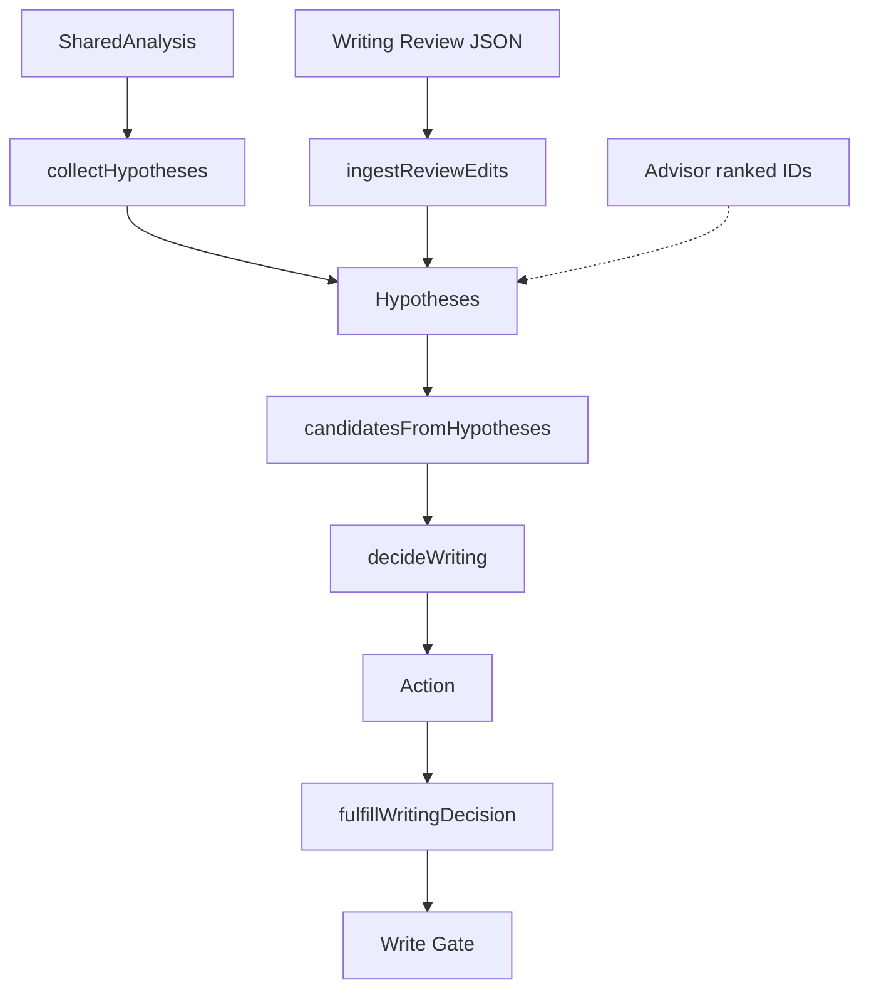

# Hypothesis system

File: `extension/src/core/engine/hypotheses.ts` plus ingest from review (`ingestReviewEdits.ts`).

A **hypothesis** is a typed, span-bounded claim: “this range might be layout / English / translate / preserve / override.” It is **not** permission to write.

**Hypothesis ≠ decision ≠ action ≠ fulfillment.** Ranking an ID does not write. Fulfillment still needs Write Gate.

## Shape (conceptual)

- `id`, `span {start,end}`, `intent`, `candidateAction`
- `replacement` (optional; Advisor **never** fills this)
- `localScore`, `risk` (`low|medium|high`), `needsLLM`
- `evidence[]`, `conflicts[]`, `sourceChunkIds`
- Review extras: `reviewKind`, `reviewConfidence`

## How they are generated

`collectHypotheses(text, caret, context, analysis)`:

1. Layout spans from `inferLayoutSpans` → `fix_layout` (if `layoutAuto`).
2. Per-chunk: preserve protected/URL/email/code; user override; instant English spell; translation if session; write-as-is.
3. Merge strong consecutive layout hyps when safe.

`ingestReviewEdits` adds **at most one** extra English/layout_suspect hyp after contract validation. It **drops** the review edit if a valid local layout hyp already covers the span, if `mapLayout` does not match `layout_suspect`, or if the span is protected/open/override/mixed-intent.

## Types of intent

| Intent | Typical action | Auto? |
| --- | --- | --- |
| `fix_layout` | `layout_fix` | If low risk, unique, policy auto |
| `fix_english` | `english_correction` | If low risk, high confidence, monolingual island (review) or instant lexicon |
| `translate` | `translation` | Session + policy |
| `preserve` / `write_as_is` | none | Never writes |
| `user_override` | none | Blocks overlapping auto |

## Candidates

`candidatesFromHypotheses` sets `eligibleForAuto` from score ≥ 0.8, risk low, replacement present, correction mode `direct`, `capabilities.autoWrite`.

## Advisor

Advisor receives **IDs only**. It returns ranked IDs. Local decision remains authority.

## Review-generated hypotheses

Same type as local English hyps. They still pass `decideWriting` + policy + Write Gate. They cannot skip mixed-language or open-token rules.

## Learning

Accept/reject and practice use **recorded events**, not a parallel hypothesis generator.
