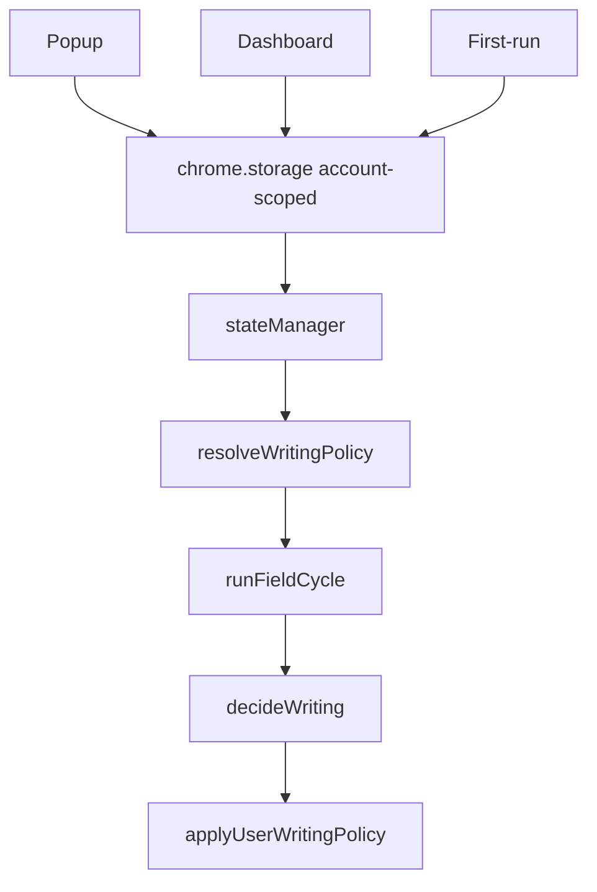

# Policy and settings

Source of truth at runtime: **`stateManager`** (`extension/src/core/state/StateManager.ts`) hydrated from **account-scoped chrome.storage**. Intent API: `extension/src/core/policy/writingPolicy.ts` (`resolveWritingPolicy`, `applyUserWritingPolicy`).

Popup and dashboard patch the same policy. There is no second hidden policy object.

## Controls

| User control | Policy / state | Effect |
| --- | --- | --- |
| Flowlary on/off | `assistantEnabled` / global pause | No analysis writes when off |
| Automatic writing | `helpStyle: 'auto'` | Auto-write when engine allows |
| Suggestions | `helpStyle: 'suggestions'` | Cards, no auto mutation |
| Shortcuts only | `helpStyle: 'shortcuts_only'` | No auto layout/English/review |
| Keyboard repair | `fixWrongTyping` | Layout hyps |
| English help | `improveEnglish` | Instant + review |
| Arabic → English | `arabicToEnglishMode` | Translation session eligible |
| AI Advisor | `aiAdvisorEnabled` | Rank hypotheses |
| AI Writing Review | `aiWritingReviewEnabled` (default **on**) | Island review |
| Site exception | `settings.excludedDomains` | User-added hosts only — **not** a Gmail/Notion denylist |

Defaults: product on; all sites eligible; user may add an exception. Nested editors use **editor capability**, not site names.

## Persistence / hydration

Content `accountBootstrap.ts` loads storage keys into `stateManager` before `startWritingRuntime`. Background `SET_SETTINGS` applies `extractPolicyPatch`. First-run answers map through `policyPatchFromFirstWin`.

## Feature flags vs policy

`correction.enabled`, `layout.autoEnabled`, `translation.liveEnabled` are **projections**. Changing helpStyle updates feature modes (`projectPolicyOntoFeatures`). Do not invent a parallel flag that auto-writes without helpStyle.

## Speed Box

Manual overlay. Does not change global helpStyle. Writes tagged `manual_box`.
