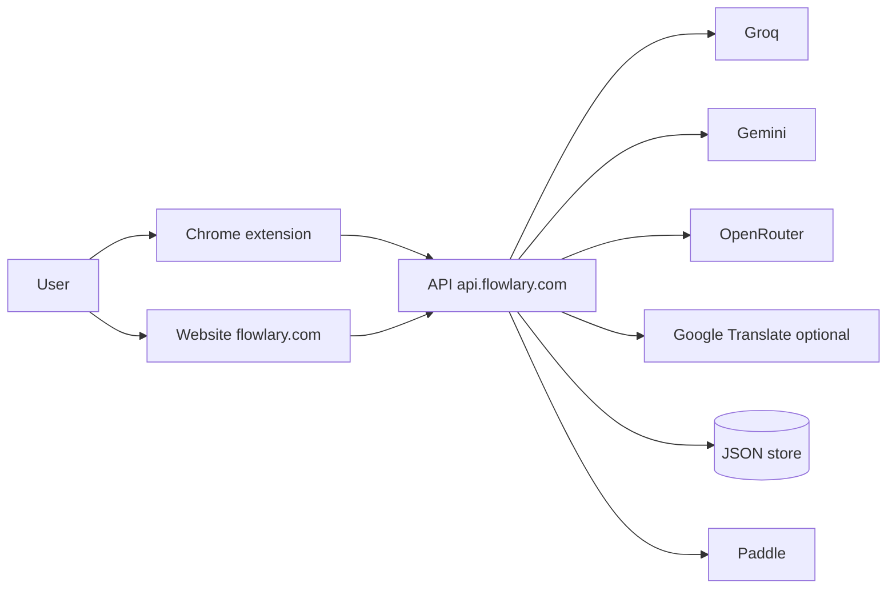

# System architecture

Flowlary is one product with **four code packages** and **three user surfaces**.

| Package | Path | Runtime |
| --- | --- | --- |
| Chrome MV3 extension | `extension/` | Content script + service worker + popup + dashboard |
| AI gateway | `backend/` | Node HTTP, JSON file store |
| Marketing / account site | `website/` | Static Vite site |
| Shared contracts | `packages/shared/` | Types, prompts, parsers |

There is **no CI directory** in this repository. Tests and builds are npm scripts.

## Surfaces



- **Extension** is the writing assistant in web fields.
- **Website** is marketing, account, pricing, support, legal, and a **demo Writing Lab**. The lab is **not** the extension engine.
- **Backend** authenticates, entitles, bills, and calls AI providers. It never writes a browser DOM.

## Repository layout

```
flowlary/
  extension/     Chrome MV3 (Vite + CRXJS)
  backend/       Gateway
  website/       Marketing + account
  packages/shared/
  tests/         Unit, integration, e2e
  deploy/        Docker, nginx, PM2
  docs/          This documentation tree
  scripts/       Build, probes, packaging
```

## Extension boot (production)

```
content_script.ts
  → InputEngine
  → CommandRouter (PIPELINE → runWritingPipeline)
  → Correction / Translation / Layout features (shortcuts / Speed Box)
  → CommandOrchestrator
  → startWritingRuntime
       bootstrap account/settings
       registerProductionHypothesisAdvisor
       registerProductionWritingReview
       establishEngineMode (enforce)
       engine.start
       startShadowEngine (observe-only duplicate)
       startEnforceCoordinator  ← the auto writer
       feature.start (schedulers are not EventBus writers)
```

Background: `extension/src/background/index.ts` — settings, account, AI proxy messages, learning, billing-adjacent session.

## One-writer principle

Only **`commitWriteTransaction`** in `extension/src/core/writeGate/writeGate.ts` may mutate the user’s field on the auto/shortcut/suggestion paths that go through the writing engine.

Feature modules **must not** register competing document listeners. `InputEngine` owns `focusin/out`, `input`, `keydown/up`, composition.

Retired EventBus writers (kept as shells): `CorrectionScheduler.start`, `TranslationScheduler.start`. Auto English and live translation run in `runFieldCycle`.

## AI role (system level)

LLMs **rank IDs** (Advisor) or **propose bounded span edits** (Writing Review / correction API / translation API). They **do not** write the DOM. The first valid provider response wins. There is **no model voting**.

## Learning (not a second engine)

```mermaid
flowchart LR
  Write[Write Gate outcome] --> Ev[Learning events]
  Card[Accept / reject UI] --> Ev
  Ev --> Local[(extension storage)]
  Ev --> API[/api/learning/events]
  Local --> Dash[Dashboard / practice / reports]
  Dash -.-> Coach[learning-coach LLM optional]
  Ev -.-> Policy[does not change decideWriting]
```

Learning **records** what happened and feeds practice/reports. It must not silently auto-write or override `mapLayout` / `decideWriting`.

## Translation (capability in the same pipeline)

```mermaid
flowchart TD
  Policy[arabicToEnglishMode + session] --> Hyp[translate hypothesis]
  Hyp --> Dec[decideWriting]
  Dec --> API[/api/ai/translation]
  API --> Ful[fulfill]
  Ful --> Tag[tag translated ranges]
  Tag --> Protect[layout/English skip tagged spans]
```

## Related

[WRITING_ENGINE.md](./WRITING_ENGINE.md) · [AI_ARCHITECTURE.md](./AI_ARCHITECTURE.md) · [ARCHITECTURE_FREEZE.md](./ARCHITECTURE_FREEZE.md)
