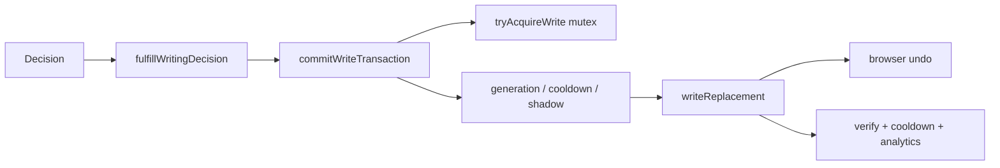

# Write Gate

File: `extension/src/core/writeGate/writeGate.ts`  
DOM: `extension/src/core/dom/editor.ts` (`writeReplacement`)

## One-writer principle

**Only `commitWriteTransaction` may mutate the user’s field** on engine paths. LLMs, Advisor, Writing Review, and `decideWriting` never touch the DOM.

## Inputs

- element, `[start, end)`, `replacement`
- `session`, `requestId`, `expectedGeneration`, `cycleGeneration`
- `origin`: `FIX_LAYOUT | TRANSLATE | CORRECT`
- `auto`, `engineOriginated`, `trigger`, `capability`, `neighborGuard`, `commitOpenToken`

## Guards (reject, do not throw)

| Guard | Outcome reason |
| --- | --- |
| Shadow engine + engine-originated | `shadow_only` |
| Auto + cooldown | `cooldown` |
| Cycle generation mismatch | `stale` |
| Mutex not held / composing | session acquire fails |
| Live text / neighbor mismatch | writeReplacement `stale` / `rejected` |

## What it may do

- Replace a **span**, not the whole document unless the span is the field.
- Prefer `document.execCommand('insertText')` so **Cmd/Ctrl+Z** works.
- Tag translated/corrected ranges on the session.
- Record analytics **without raw text**.

## What it must not do

- Call providers.
- Re-run `decideWriting`.
- Write if the user has typed since the snapshot.

## Fulfillment vs write

`fulfillWritingDecision` may return `suggestion` and call `presentPipelineSuggestion` with **no** Write Gate. Accepting the card is a **new** write with `trigger: 'suggestion_accept'`.
