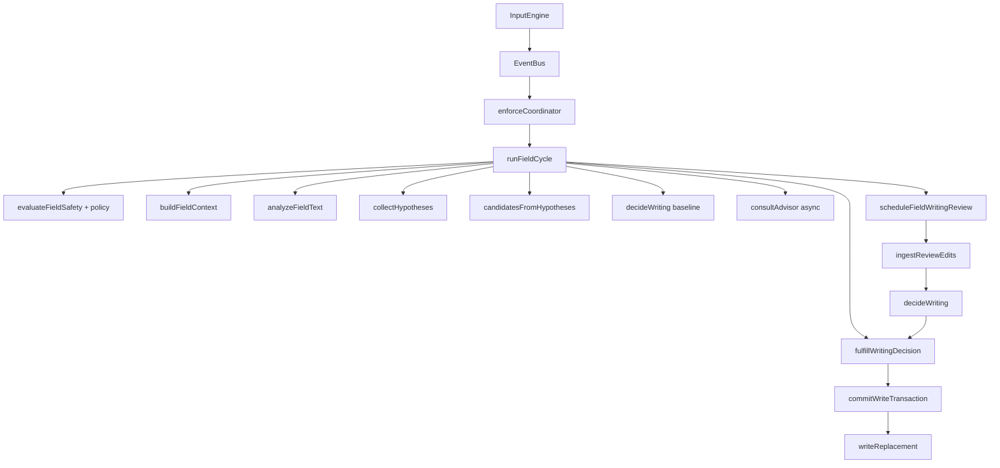

# Writing engine

This is the core of Flowlary. Implementation: `extension/src/core/` plus feature modules used only for shortcuts, Speed Box, and UI.

## Pipeline

Authoritative files:

| Layer | File | Allowed | Forbidden |
| --- | --- | --- | --- |
| Observer | `core/input/InputEngine.ts` | Listen, emit, track composition/paste | Mutate field |
| Session | `core/session/FieldSession.ts` | Generation, mutex, cooldown, review cache | DOM write |
| Safety | `core/safety/*` | Block unsafe fields | Invent site denylists |
| Policy | `core/policy/writingPolicy.ts` | Resolve user intent | Bypass Write Gate |
| Context | `core/engine/context.ts` | Editor tier, capabilities | Network |
| Analysis | `core/engine/chunks.ts` | Evidence, roles, layout spans | User intent, writes |
| Hypotheses | `core/engine/hypotheses.ts` | Candidates with spans | Apply them |
| Decision | `core/engine/decide.ts` | One action or noop | DOM, network |
| Advisor | `core/engine/advisor.ts` | Rank IDs asynchronously | Replacement text, auto-write on late tick |
| Review | `core/engine/writingReview.ts` + `ingestReviewEdits.ts` | Island packet + span hyps | Whole-field rewrite |
| Fulfill | `writeGate/pipeline.ts` | Call Write Gate or suggestion UI | Direct `value =` |
| Write Gate | `writeGate/writeGate.ts` | Single mutator | — |
| DOM | `core/dom/editor.ts` | `execCommand` / `setRangeText` with undo | Bypass session checks |

## Layer contracts

### InputEngine
- **In:** DOM events. **Out:** EventBus (`input`, `keydown`, `keyup`, `focus-in/out`, composition).
- **Sync:** Immediate. Never awaits AI.
- **Failure:** Ignore non-editable targets.

### enforceCoordinator
- **In:** EventBus. **Out:** `runFieldCycle`.
- Triggers: non-composing `input`; `keyup` Space/Enter/Tab; `focus-out`.

### runFieldCycle
- **In:** element + `FieldSession`. **Out:** `applied | noop | suggestion | stale | blocked`.
- Local decision **always** completes before Writing Review.
- Advisor consult is fire-and-forget after baseline; apply mode may only **suggest**, never auto-write layout/translate/English on a late tick.

### FieldSession
- Bumps **generation** on user input (invalidates in-flight AI).
- **Mutex** `tryAcquireWrite`.
- **Cooldown** after auto-write (`WRITE_COOLDOWN_MS` 450).
- Caches review island hashes; paused review timer; abort controllers for generation.

### Synchronization
- User’s latest text always wins. Stale generation → no write.
- Paste/drop recorded as `inputSource`; review and auto layout skip paste.
- Composition: no cycle writes while composing.

## Three capabilities (one decision)

| Capability | Evidence | Auto-write when | Else |
| --- | --- | --- | --- |
| Layout | `layoutSequence` + `mapLayout` | Unique low-risk layout hyp, helpStyle auto, not mixed-intent | Suggestion / shortcut / noop |
| English | Instant lexicon + review islands | High-confidence spelling/grammar/punct, monolingual English island, helpStyle auto | Suggestion / shortcut |
| Translation | Arabic→English **session** + policy | Session on, arabicToEnglishMode, completed segment, helpStyle auto | Shortcut / Speed Box |

They must not fight: `decideWriting` blocks English when strong layout overlaps; mixed Arabic+English blocks blob translate and unsafe layout; translated ranges are tagged and not polished unless `polishAfterTranslate`.

## Write paths (complete)

1. Auto `fulfillWritingDecision` → Write Gate (`trigger: 'auto'`).
2. Suggestion accept (`pipelineSuggest.ts`, `trigger: 'suggestion_accept'`).
3. Shortcuts: `FIX_LAYOUT`, `CORRECT` (`runExplicitEnglishAssist`), `TRANSLATE`.
4. Speed Box (`LayoutFeature.handleSpeedBox`, `trigger: 'manual_box'`).

`CORRECT_TEXT` whole-field LLM still exists for Speed Box / practice / website-adjacent clients. It is **not** the auto English path.

## Feedback / learning

After a verified write, layout/correction/translation may record **history** and **learning events**. Learning must not become a second decision engine. See [HYPOTHESIS_SYSTEM.md](./HYPOTHESIS_SYSTEM.md) and product learning docs.

## Related

[DECISION_ENGINE.md](./DECISION_ENGINE.md) · [WRITE_GATE.md](./WRITE_GATE.md) · [WRITING_REVIEW.md](./WRITING_REVIEW.md)
