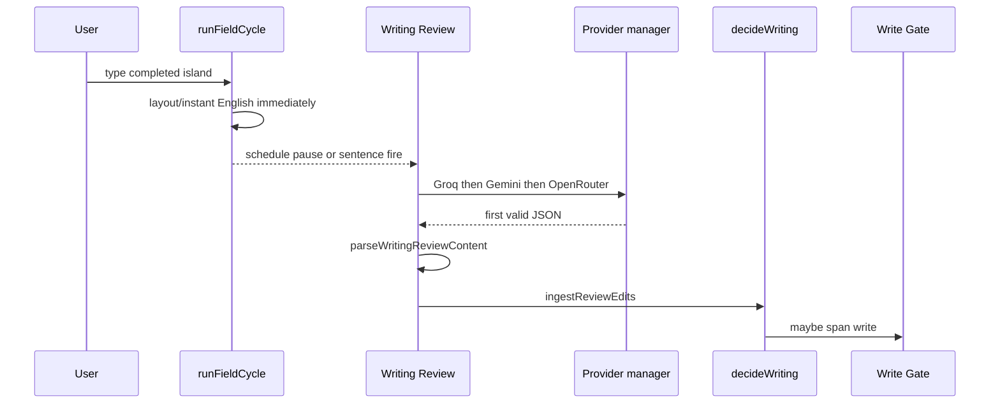

# Writing Review

Production path. Code: `writingReview.ts`, `reviewIsland.ts`, `ingestReviewEdits.ts`, `pipeline.ts` (`scheduleFieldWritingReview`), `writingReviewClient.ts`, `background/reviewWriting.ts`, `backend/src/providers/writingReview*.ts`, `packages/shared/src/ai/writingReview.ts`.

## Runtime

Typing **never** waits for this sequence.

Triggers: sentence boundary **or** word boundary + ~900ms pause (`REVIEW_PAUSE_MS`). Min interval 2500ms. Not every keystroke.

## Why not whole-field rewrite

Mixed fields must keep Arabic and English. The model sees **one Latin island** (example: `hello are you comming or not` inside `مرحبا … نعم …`). Edits must satisfy `original === snippet.slice(start,end)`, non-overlapping, max 8 edits, max proposed 80 chars. Forbidden keys: write/html/DOM/commands.

## Allowed kinds

`spelling`, `grammar`, `punctuation`, `layout_suspect`.  
`wording` / style polish → **rejected**.  
`layout_suspect` only if `proposed === mapLayout(original)`. Prefer existing local layout hyp if already valid.

## Auto vs suggestion

Auto requires roughly: `helpStyle === auto`, kind in spelling/grammar/punctuation, confidence high, **monolingual English island**, original still in live text, no protected/open/override/mixed conflict, generation current.

Otherwise: suggestion or noop.

## Skip

Paste/drop, composing, selection, open token overlapping island, sensitive tokens (JWT, API key, URL, email, …), password fields, editorTier > 2, shortcuts_only, Review setting off, cached island, local layout just applied, stale generation.

## Fallback

Failure-only. Independent of advisor ranking fallback. If all fail: local decision remains.

Further evidence: [../audit/WRITING_REVIEW_PRODUCTION_PATH.md](../audit/WRITING_REVIEW_PRODUCTION_PATH.md) (historical probe notes).
