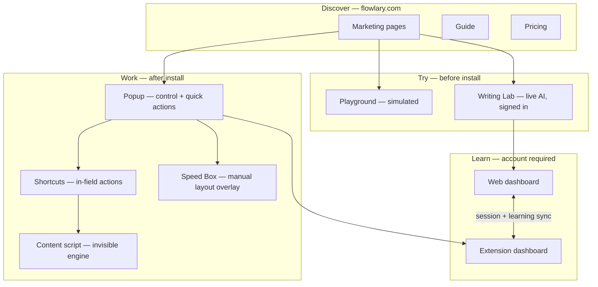

# Flowlary Website Revamp Audit

**Date:** 2026-09-02  
**Scope:** Marketing site, account workspace, Writing Lab, playground, and their relationship to the Chrome extension surfaces (popup, dashboard, shortcuts, Speed Box).  
**Purpose:** Baseline audit before a full brand, IA, and UX revamp — focused on enterprise-grade clarity, zero overlap, and intentional cross-surface integration.

---

## Executive Summary

Flowlary is a Chrome writing companion for mixed Arabic/English users: keyboard layout repair, bounded English correction, optional translation, and a learning loop — all in the field the user is already typing in. The website is a static React app (`website/`) that serves marketing, auth, billing, a web dashboard, and Writing Lab.

**Verdict:** The site has a coherent product narrative (Write → Communicate → Learn) and a shared design token system with the extension, but it reads as an **accumulated Phase 1 patchwork**, not a unified brand experience. The same story is told four or more times across pages; support content is triplicated; interactive destinations are hidden behind hash URLs; and users cannot easily understand **which surface does what** (popup vs dashboard vs website vs shortcuts vs Speed Box).

A revamp should not add more sections — it should **subtract, reorganize, and interconnect** around a single mental model: *where you write* (extension), *where you learn* (dashboard), *where you discover* (marketing site).

---

## 1. Product Surface Map

Every place a user interacts with Flowlary must have one clear job. Today there are **nine distinct surfaces**, with blurred boundaries.

| Surface | Entry | Primary job | Secondary job | User confusion risk |
|---------|-------|-------------|---------------|----------------------|
| **Marketing homepage** | `/` | Acquire, explain value | Scroll through Write/Communicate/Learn | Hero shows popup mock; user may think site *is* the product |
| **Feature pages** | `/features/*` | Deep-dive one capability | Repeat homepage narrative | Same demos, same pillars, different wrapper |
| **Playground** | `/#try-flowlary` | Try simulated features | None declared | Not in nav; 4 modes but Speed Box unwired; "simulated" vs Writing Lab "real" unclear |
| **Writing Lab** | `/#writing-lab` | Live AI correction + learning ingest | Bridge to extension install | Not in nav; requires sign-in; feels like a separate app on the homepage URL |
| **Account auth** | `/account` (signed out) | Login / register | Student intent, billing entry | Same URL becomes dashboard after login — jarring context switch |
| **Web dashboard** | `/account#overview` etc. | Learning workspace | Extension sync status | Hash routing on account page; mirrors extension dashboard but differs in history/settings |
| **Extension popup** | Chrome toolbar | Pause, toggles, quick actions | Usage strip, dashboard link | Marketing mock may not match live popup after Phase 1H drift |
| **Extension dashboard** | Options tab | Full product workspace | History, deep settings | Opens in tab; user may not know it exists vs web dashboard |
| **Speed Box overlay** | `⌘⇧L` / `Ctrl+Shift+L` | Manual layout repair on demand | None | Explained on feature page and support; not in playground; easy to confuse with popup layout toggle |

### Surface hierarchy (what users need to understand)



**Revamp principle:** Each surface gets a **one-sentence contract** visible to users, not just internal docs.

| Surface | Contract (proposed) |
|---------|---------------------|
| Popup | *Control center — turn Flowlary on/off, choose what runs, act fast.* |
| Shortcuts | *Do the work in your field — fix, translate, repair layout without opening anything.* |
| Speed Box | *When layout is wrong and you want to see options — open, pick, close.* |
| Extension dashboard | *Your full workspace while you write in Chrome — history, settings, practice.* |
| Web dashboard | *Same account, same progress — practice, reports, billing, anywhere.* |
| Writing Lab | *Try real correction on the web; progress counts toward your account.* |
| Playground | *See how it feels — simulated, no account needed.* |
| Marketing site | *Understand what Flowlary is and whether it fits you.* |

---

## 2. Current Site Inventory

### 2.1 Routes and pages

| Route | Component | Status | Revamp note |
|-------|-----------|--------|-------------|
| `/` | `HomePage` | Live | Default marketing; hash modes replace entire page |
| `/#write`, `/#communicate`, `/#learn`, `/#how` | Home anchors | Live | Communicate/Learn have no nav entries |
| `/#writing-lab` | `WritingLab` | Live | Hidden destination |
| `/#try-flowlary` | `PlaygroundSection` | Live | Hidden destination; Speed Box mode unwired |
| `/features` | `FeaturesShowcase` | Live | Duplicates home narrative |
| `/features/writing-correction` | Feature page | Live | Keep as deep-link |
| `/features/translation` | Feature page | Live | Keep |
| `/features/live-translation` | Feature page | Live | Keep |
| `/features/keyboard-layout` | Feature page | Live | Keep |
| `/features/speed-box` | Feature page | Live | Keep |
| `/pricing` | `PricingShowcase` | Live | Strong; reconcile Pro value vs Free |
| `/about` | `AboutShowcase` | Live | Not in header; repeats proof sections |
| `/guide` | `GuideShowcase` | Live | Footer only; overlaps Support |
| `/support` | `SupportCenter` | Live | Overlaps Guide + Feedback |
| `/feedback` | `FeedbackHub` | Live | Requires sign-in; overlaps Support tickets |
| `/contact` | Contact | Live | OK as terminal page |
| `/blog` | Blog | **Placeholder** | Empty; remove or commit |
| `/account` | Account + dashboard | Live | Auth + workspace on one URL |
| `/account/support` | Tickets | Live | Third support entry point |
| `/privacy`, `/terms`, `/cookies` | Legal | Live | OK |
| `/admin/*` | Internal | Live | Out of revamp scope |

**Metadata drift:** `/about` not prerendered; several account/admin routes missing from `routes.ts` and `seo.ts`.

### 2.2 Homepage sections (current order)

1. Hero + popup preview  
2. Problem  
3. Write (`#write`)  
4. Communicate (`#communicate`)  
5. Learn (`#learn`)  
6. Product proof (platforms, stats, reviews, feature requests)  
7. How it works (`#how`)  
8. Why Flowlary  
9. Final CTA  

**Issues:** 9 sections before conversion; Product proof is API-conditional (inconsistent social proof); Why + Problem overlap philosophically; Learn section previews dashboard without explaining web vs extension dashboard.

### 2.3 Orphan / dead code (marketing)

These components exist but are **not imported** in the live app:

- `CapabilitySections.tsx`
- `ControlPhilosophy.tsx`
- `PopupShowcase.tsx`
- `ProductOverview.tsx`
- `ProblemStory.tsx`
- `SafetySection.tsx`

**Action:** Delete or merge in revamp — they represent abandoned IA branches and will confuse future work.

---

## 3. Brand & Visual Design Assessment

### 3.1 Current identity

| Element | Current state | Assessment |
|---------|---------------|------------|
| Name | Flowlary | Strong, distinctive |
| Tagline | "Your AI Writing Companion" | Generic; competes with every AI writing tool |
| Visual system | "Snow / frost glass" dark default | Phase 1 foundation is solid but feels **2024 SaaS template** |
| Typography | Segoe / SF system stacks | Safe, not branded |
| Accent | `#5b8cff` blue | Functional, not ownable |
| Logo | SVG mark in `Logo.tsx` | Exists; not leveraged as brand anchor |
| Motion | Scroll reveal, demo sequences | Nice; overused across pages creates sameness |

**Token chain:** `packages/shared/src/tokens.css` → `website/src/styles/tokens.css` → page CSS. Extension parity tested in `logo.test.tsx`. Revamp should **extend shared tokens**, not fork them.

### 3.2 CSS fragmentation

11+ stylesheets: `global.css`, `glass.css`, `home.css`, `playground.css`, `account.css`, `dashboard.css`, `features-page.css`, `writing-lab.css`, `product-pages.css`, etc.

**Four different "final CTA" patterns:**

- `.mh-final-panel` (home)
- `.feat-final-panel` (features)
- `.pr-final-card` (pricing)
- `.sp-contact` (support)

Same job, four implementations. Enterprise sites unify conversion moments.

### 3.3 Design gaps for "major company" bar

| Gap | Evidence |
|-----|----------|
| No cohesive brand story beyond feature list | About page exists but buried |
| Mock interfaces without consistent disclaimer placement | `mockCaption` in i18n but uneven usage |
| No editorial voice system | 2200+ lines in `en.ts` with mixed tones |
| No photography / human trust layer | All UI mocks and glass cards |
| No progressive disclosure model | Support page is one long scroll of `<details>` |
| Dashboard uses different density than marketing | Feels like two products |

---

## 4. Content & Information Architecture Audit

### 4.1 Narrative repetition map

The **Write → Communicate → Learn** journey appears in:

| Location | Format |
|----------|--------|
| Homepage | 3 full sections + hero |
| `/features` | 3 journey sections + connected flow |
| `/about` | 5 numbered capabilities |
| `/support` | Feature help accordions |
| `/guide` | Dashboard link cards + steps |
| Feature detail pages | What/Why/How/Mode grids |

**Impact:** A user who reads Home + Features + About gets **~70% duplicate copy** with different demos. Enterprise IA assigns each idea **one canonical home**.

### 4.2 Support triplication

| Content | Guide | Support | Feedback |
|---------|:-----:|:-------:|:--------:|
| Install steps | ✓ | ✓ | — |
| Keyboard shortcuts | ✓ | ✓ (duplicate component logic) | — |
| Feature how-to | partial | ✓ | — |
| Submit ticket | link | hub links | ✓ tab |
| Feature requests | — | link | ✓ tab |

Three entry points for support (`/support`, `/feedback`, `/account/support`) with no hierarchy.

**Proposed consolidation:**

- **Guide** → single onboarding path (install → first win → shortcuts → dashboard)  
- **Support** → searchable knowledge base only (no install duplication)  
- **Feedback** → product input (ideas + general feedback), not tickets  
- **Account support** → signed-in ticket inbox (same backend, one UX pattern)

### 4.3 Navigation gaps

**Header today:** Product (`/#write`), How it works, Features, Students, Pricing, Account, Get Flowlary.

**Missing from header but exist:**

- About, Blog, Guide, Contact, Writing Lab, Playground, Feedback

**Confusing behaviors:**

- "Product" nav → `/#write` skips hero; also marked active on bare `/`  
- `#communicate` and `#learn` have section IDs but no nav  
- Writing Lab and Playground only linked from deep CTAs

### 4.4 Copy & positioning drift

| Source | Emphasis |
|--------|----------|
| Root README | Mixed Arabic/English keyboard + translation |
| Homepage i18n | "Learn English through your writing" |
| About i18n | Tool fragmentation, language switching |
| Feature pages | Capability-first |

**Revamp must pick one primary persona** (or a clear primary/secondary split) and thread it through every page. Current copy tries to be everything.

### 4.5 CTA inconsistency

- Primary CTA: "Get Flowlary" → `CHROME_WEB_STORE_URL` is `null` → falls back to `/support#get-flowlary`  
- Users expect install; get support docs  
- Feature pages use `t.home.finalTitle` (stale keys) for `CtaBanner`  
- Secondary CTAs point to `/#how`, pricing, or playground inconsistently

---

## 5. Cross-Surface Integration Audit

### 5.1 Website ↔ Extension bridge

**Implemented:** `websiteBridge.ts` / `extensionBridge.ts` via `postMessage`

| Message | Direction | Purpose |
|---------|-----------|---------|
| `account-session` | Web → Ext | Push JWT after login |
| `open-dashboard` | Web → Ext | Deep-link practice/report |
| `bridge-ready` | Ext → Web | Extension detected |

**Sync:** `ExtensionSessionSync.tsx` — mount, focus, storage, 60s interval.

**Gaps for revamp:**

- Marketing never explains *why* sign-in on web matters for extension  
- Dashboard shows extension status but marketing doesn't set expectation  
- Writing Lab → extension install CTA exists but isn't part of homepage funnel  
- Popup preview on site may drift from live popup UI

### 5.2 Dashboard parity (web vs extension)

Both use **Write / Learn / Account** nav groups. Differences:

| Capability | Web | Extension |
|------------|:---:|:---------:|
| Overview + coach | ✓ | ✓ |
| Practice / Progress / Report | ✓ | ✓ |
| History / activity | ✗ | ✓ |
| Live in-page writing | Writing Lab only | ✓ all sites |
| Full writing policy settings | partial | ✓ |
| Deep practice links | `#practice?target=` | via bridge |

**Revamp:** One comparison table in Guide/Support — not repeated prose on five pages.

### 5.3 Shortcuts as a first-class concept

Defined in `website/src/config.ts`, duplicated in Guide and Support:

| Shortcut | Action |
|----------|--------|
| ⌘⇧E / Ctrl+Shift+E | English assist |
| ⌘⇧, / Ctrl+Shift+, | Translate |
| ⌘⇧P / Ctrl+Shift+P | Fix keyboard layout |
| ⌘⇧L / Ctrl+Shift+L | Speed Box |

**Issue:** Shortcuts are explained as documentation, not as a **product surface**. Users don't understand shortcuts vs popup quick actions vs Speed Box.

**Revamp:** Dedicated "How you control Flowlary" module — one visual system showing popup (policy) vs shortcuts (actions) vs Speed Box (manual overlay).

### 5.4 Learning loop interconnect

```
Extension field corrections ──► Learning events API ◄── Writing Lab ingest
                                        │
                                        ▼
                              Web + Extension dashboards
```

Marketing **Learn** section shows a pattern card but doesn't connect to Writing Lab, Practice, or Pro gating. Pricing understates Pro learning value (per `PHASE24_FEATURE_MATRIX.md`).

---

## 6. UX Confusion & Distraction Register

Priority-ordered issues to fix in revamp:

| # | Issue | Severity | Fix direction |
|---|-------|----------|---------------|
| 1 | Homepage has 3 personalities (`/`, `/#writing-lab`, `/#try-flowlary`) | High | Separate routes or clear mode switcher; never replace entire page silently |
| 2 | Same story on Home, Features, About | High | One narrative page; Features becomes capability index only |
| 3 | Support / Guide / Feedback overlap | High | Merge into 2 surfaces max |
| 4 | Popup vs dashboard vs web dashboard unexplained | High | "Surfaces" page or persistent help module |
| 5 | Get Flowlary → support page | High | Honest CTA copy until CWS live; or "Join waitlist" |
| 6 | Playground missing Speed Box mode | Medium | Wire or remove from marketing claims |
| 7 | Account URL = auth + dashboard | Medium | Consider `/dashboard` route post-login |
| 8 | Blog placeholder | Low | Remove from routes/i18n or ship one post |
| 9 | Conditional social proof on homepage | Medium | Static fallback + live enhancement |
| 10 | 6 orphan marketing components | Low | Delete in cleanup pass |
| 11 | 4 final-CTA CSS patterns | Low | Single `ConversionPanel` component |
| 12 | Feature page CTA uses stale i18n keys | Low | Unified copy source |

---

## 7. What to Delete, Add, and Reorganize

### 7.1 Delete or archive

- [ ] Orphan marketing components (6 files)  
- [ ] `/blog` route until content strategy exists  
- [ ] Duplicate shortcut rendering in Support (use shared component)  
- [ ] Redundant "Why Flowlary" if merged into About or hero  
- [ ] Second and third telling of Write/Communicate/Learn on Features page  
- [ ] `ProductProofSections` duplicate on About (import once or link)  

### 7.2 Add (new brand & sections)

- [ ] **Brand foundation doc** — voice, persona, promise, anti-patterns  
- [ ] **Surfaces explainer** — popup, shortcuts, Speed Box, dashboards (one canonical page)  
- [ ] **Unified conversion panel** — one component, one copy source  
- [ ] **Onboarding path** — Guide as linear funnel, not wiki  
- [ ] **Trust layer** — security/privacy/control as designed section, not scattered bullets  
- [ ] **Pro value story** — learning coach, reports, export as hero tier differentiation  
- [ ] **Writing Lab entry** — deliberate nav item post-sign-in or "Try it" in header  
- [ ] **Visual identity refresh** — typography, color, spacing beyond glass template  

### 7.3 Reorganize (proposed IA)

```
MARKETING
├── Home          — promise, problem, one demo, social proof, CTA
├── Product       — surfaces map (popup / shortcuts / speed box / dashboards)
├── Features      — capability index → detail pages (no journey repeat)
├── Pricing       — plans + student + FAQ
├── About         — story, team/trust, principles
└── Contact       — human escalation

TRY
├── Playground    — /try (simulated, public)
└── Writing Lab   — /lab (live, signed-in)

LEARN & ACCOUNT
├── /account      — auth only when signed out
└── /dashboard    — workspace when signed in (optional URL split)

HELP
├── Guide         — install → first win → shortcuts (linear)
├── Support       — searchable KB
└── Feedback      — ideas + general feedback (not tickets)

LEGAL
└── Privacy / Terms / Cookies
```

### 7.4 Prevent overlap rules

1. **One idea, one page** — journey narrative lives on Home only  
2. **One support path** — tickets only in account; KB in support; ideas in feedback  
3. **One CTA component** — same primary/secondary pattern everywhere  
4. **One shortcuts source** — `config.ts` + one `ShortcutsReference` component  
5. **One dashboard story** — web vs extension diff in one table, linked from both dashboards  
6. **Mocks labeled consistently** — always show `mockCaption` near previews  

---

## 8. Recommended Brand Direction (starting points)

These are audit recommendations, not final decisions:

| Dimension | Current | Revamp direction |
|-----------|---------|------------------|
| Position | AI writing companion | **In-flow writing partner** — emphasizes "never leave your field" |
| Primary user | Unclear | **Bilingual professional/learner** who writes in English daily with Arabic context |
| Tone | Calm, cautious | **Confident, precise, warm** — enterprise clarity without corporate coldness |
| Visual | Glass dark SaaS | **Editorial + product** — strong typography, restrained color, real product screenshots |
| Tagline candidates | — | "Write where you are." / "Stay in the flow." / "English help, right in your field." |
| Hero proof | Popup mock | Popup mock + **one real 15s capture** of correction in Gmail/Notion |

---

## 9. Implementation Phases (suggested)

### Phase A — Foundation (no new pages)

- Delete orphan components  
- Unify CTA component and copy keys  
- Extract `ShortcutsReference` shared component  
- Fix route/SEO/prerender parity  
- Align popup preview with live extension  
- Wire or remove Speed Box playground mode  

### Phase B — IA & content

- Rewrite Home as single narrative (cut to 5–6 sections)  
- Slim Features to index + detail pages  
- Consolidate Guide/Support/Feedback  
- Add Surfaces explainer page  
- Reconcile pricing copy with Pro learning value  

### Phase C — Brand & visual

- New typography and color direction in shared tokens  
- Logo refinement and favicon/OG system  
- Photography/illustration direction  
- Dashboard visual alignment with marketing  
- Component library audit (`Ui.tsx` → structured kit)  

### Phase D — Integration polish

- `/dashboard` route split from `/account` (optional)  
- `/try` and `/lab` as first-class routes  
- Extension install funnel when CWS URL live  
- Cross-surface onboarding checklist in Guide  
- i18n pass (12 locales) after English lock  

---

## 10. Key Files Reference

| Area | Path |
|------|------|
| Routing | `website/src/App.tsx`, `website/src/routes.ts` |
| Navigation | `website/src/components/Layout.tsx` |
| Homepage | `website/src/pages/Home.tsx`, `website/src/components/marketing/*` |
| Features | `website/src/components/features/FeaturesShowcase.tsx` |
| Popup mock | `website/src/components/demos/PopupPreview.tsx` |
| Playground | `website/src/components/playground/PlaygroundSection.tsx` |
| Writing Lab | `website/src/lab/WritingLab.tsx` |
| Dashboard | `website/src/dashboard/DashboardApp.tsx` |
| Support/Guide | `website/src/components/support/SupportCenter.tsx`, `website/src/components/guide/GuideShowcase.tsx` |
| Copy source | `website/src/i18n/en.ts` |
| Design tokens | `packages/shared/src/tokens.css`, `website/src/styles/tokens.css` |
| Shortcuts | `website/src/config.ts` |
| Extension bridge | `website/src/account/extensionBridge.ts` |
| Prior design phases | `docs/design/FLLOWLARY_PHASE_1*.md` |
| Product truth | `docs/product/PRODUCT_OVERVIEW.md`, `docs/audits/KNOWN_LIMITATIONS.md` |

---

## 11. Success Criteria for Revamp

The revamp is done when:

1. A first-time visitor understands **what Flowlary is** in 10 seconds and **where it runs** in 30 seconds.  
2. A user can explain the difference between **popup, shortcuts, Speed Box, and dashboard** without reading support.  
3. No two pages tell the full Write/Communicate/Learn story end-to-end.  
4. Support content exists in **exactly one** searchable location; tickets in **exactly one** signed-in location.  
5. Every mock is labeled; every live feature (Writing Lab) is clearly distinguished from playground.  
6. Web and extension dashboards feel like **one product, two surfaces** — same language, same nav groups, documented differences.  
7. Visual design meets enterprise SaaS bar: intentional typography, consistent spacing, one conversion pattern, accessible contrast.  
8. Primary CTA honestly reflects install availability.  

---

## Appendix: Related Audits

| Doc | Relevance |
|-----|-----------|
| `docs/design/FLLOWLARY_PHASE_1D_MARKETING_IMPLEMENTATION.md` | Current homepage IA rationale |
| `docs/design/FLLOWLARY_PHASE_1E_MARKETING_RECONCILIATION.md` | Features/pricing restructure |
| `docs/design/FLLOWLARY_PHASE_1G_DASHBOARD_WORKSPACE_RECONCILIATION.md` | Dashboard IA |
| `docs/audit/WL11_UNIFIED_PRODUCT_EXPERIENCE_IMPLEMENTATION.md` | Website↔extension bridge |
| `docs/audit/FINAL_PRODUCT_GAP_AUDIT.md` | Extension UX gaps |
| `docs/monetization/PHASE24_FEATURE_MATRIX.md` | Pro value understating |
| `docs/audits/KNOWN_LIMITATIONS.md` | Must-not-claim list for marketing |

**Authority rule:** On conflict, **code + freeze docs + KNOWN_LIMITATIONS** win over this audit and historical phase reports.
