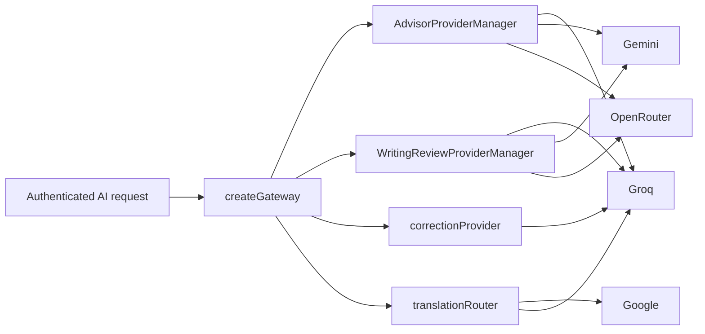

# Providers

Adapters in `backend/src/providers/`. Health: `backend/src/health/providerHealth.ts`.

## Writing-path cloud chain

| Slot | Default model | Ranking enabled default | Review uses key if present |
| --- | --- | --- | --- |
| Groq | `openai/gpt-oss-20b` | yes | yes |
| Gemini | `gemini-3.5-flash-lite` | no | yes if `GEMINI_API_KEY` |
| OpenRouter | must set `OPENROUTER_ADVISOR_MODEL` | no | yes if key + model |

**Advisor ranking fallback** default **off** (safe ranking budget).  
**Writing Review fallback** default **on** (failure-only).

Sequential, first valid JSON wins, max 3 attempts, RPM per provider + global.

## Other

- **Correction / layout classify:** Groq chat (`correctionProvider`, `layoutClassifierProvider`).
- **Translation:** Google (optional) then Groq if `TRANSLATION_ALLOW_GROQ_FALLBACK`; `TRANSLATION_FORCE_PROVIDER` can pin.

## Contracts

- Advisor: ID-only, `packages/shared` prompt + backend `advisorValidation.ts`.
- Writing Review: `parseWritingReviewContent` / `writingReviewValidation.ts`.
- Correction: `validateCorrectionResponse` in shared.

Never log API keys. Never print snippets in probes (sanitized scripts: `scripts/advisor-live-probe.ts`, `scripts/writing-review-live-probe.ts`).
