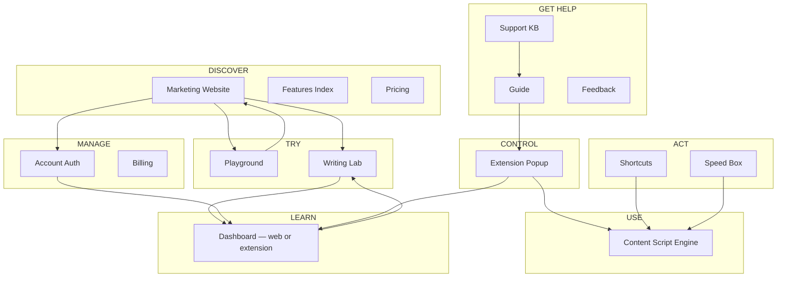

# Flowlary Product Experience 2.0 — Phase 0 Foundation

**Document type:** Strategic design foundation (source of truth for redesign phases)  
**Date:** 2026-09-02  
**Status:** Phase 0 — Architecture only. No implementation.  
**Authority:** Code and product/freeze docs override this document on conflict. Historical audits and phase reports are inputs, not gospel.

---

## 1. Executive Summary

Flowlary is a **Chrome extension** that helps people write in the fields they already use — with particular strength for **mixed Arabic/English** contexts: wrong-keyboard repair, bounded English correction, optional translation, and a learning loop fed by real writing activity. The website is a discovery, account, and web-workspace layer — not the product itself.

**The core problem today is not visual quality.** It is **ecosystem fragmentation**: users encounter Flowlary as a website, a popup, two dashboards, shortcuts, Speed Box, Writing Lab, and Playground — without a shared mental model of why each exists or how they connect.

**Phase 0 conclusion:** Rebuild the experience around one principle:

> **One product. Different places for different jobs.**

This document defines product truth, users, positioning, brand, surface architecture, website IA, journeys, UX constitution, content architecture, visual direction, design system strategy, and a phased roadmap — without changing any application code.

**Recommended direction (preview):**

| Dimension | Recommendation |
|-----------|----------------|
| **Primary positioning** | In-flow writing for bilingual daily writers |
| **Secondary positioning** | Learning that follows from real writing, not separate lessons |
| **Primary persona** | The daily bilingual Chrome writer (Arabic/English primary evidence) |
| **Surface model** | Nine intentional surfaces organized in eight functional layers |
| **Dashboard model** | One dashboard concept, two entry contexts (web + extension) |
| **Visual direction** | Territory B: Precision + Human |
| **Next phase** | Phase 1 — Information Architecture + Content |

---

## 2. Product Definition

### 2.1 What Flowlary is (evidence-based)

Flowlary is a **Chrome writing companion** for people who mix Arabic and English. It repairs wrong-keyboard input, offers bounded English help, and optional Arabic→English translation **in the field the user is already typing in**.

> "It is **not** a separate editor, not a chatbot, and not a style rewriter."  
> — `docs/product/PRODUCT_OVERVIEW.md`

**Architectural truth:** LLMs rank hypotheses or propose island spans. They do not write the DOM. Only **Write Gate** mutates the field.

> "Website Writing Lab ≠ extension engine."  
> — `README.md`, `docs/audits/KNOWN_LIMITATIONS.md`

### 2.2 Actual capabilities (what ships today)

| Capability | Mechanism | AI required? | Notes |
|------------|-----------|:------------:|-------|
| Keyboard layout repair | Local `mapLayout` + evidence; optional AI classify | Sometimes | Unlimited on Free when local |
| English instant typos | Local lexicon in field cycle | No | Immediate |
| English Writing Review | Async after pause on English island | Yes | Island-based, not whole-field rewrite |
| Translation (shortcut) | Gateway API → Write Gate | Yes (weighted) | User-initiated |
| Live translation | Session mode + completed Arabic segments | Yes | Default-off; requires session |
| Speed Box | Manual overlay (`manual_box` trigger) | No | Layout repair tool; unlimited |
| Pause / site exception | Popup policy | No | Per-host control |
| Learning events sync | API `POST/GET/DELETE /api/learning/events` | — | Unified across web + extension |
| Practice / Progress / Report | Dashboard panels | Partial | Pro depth differs |
| Learning Coach | AI-backed (Pro/Trial) | Yes | Dashboard feature |
| Writing Lab (web) | Gateway correction API | Yes | Signed-in; not extension engine |
| Playground (web) | Simulated demos | No | Not live product |
| Account / billing | Paddle, JWT sessions | — | Website-primary |
| Extension ↔ web session bridge | `postMessage` protocol | — | `websiteBridge.ts` |

**Interaction rule (critical):** `decideWriting` picks **one** action. Layout uniqueness blocks English on the same span.

### 2.3 Target users (evidence, not aspiration)

| Signal | Source |
|--------|--------|
| Mixed Arabic/English | README, CAPABILITIES, keyboard layouts (ar-101, fa-standard), translation pair |
| Chrome-only | MV3 extension; marketing "Works in Chrome" |
| Daily field writing | Gmail, Notion, ChatGPT referenced in docs and copy |
| English learners | Secondary i18n narrative (`home.heroTitle`: "Learn English through your writing") |
| Students | `/pricing#students`, student verification flow |
| Professionals who write | Problem framing: messages, emails, daily drafts |

**Assumption to flag:** Flowlary's *code* is deeply bilingual Arabic/English; its *marketing* sometimes leads with English learning. These are related but not identical audiences.

### 2.4 Primary and secondary use cases

**Primary use case:** Write in a web field → encounter layout mistake, language switch, or English error → get help **without leaving the field** → continue writing.

**Secondary use cases:**
- Translate Arabic text to English in context
- Review recurring English patterns over time
- Practice targeted errors from real writing history
- Try correction on the website before or without extension install
- Manage account, billing, and learning data from any browser

### 2.5 User problems Flowlary addresses

| Problem | Product response |
|---------|------------------|
| Wrong keyboard layout mid-sentence | Local layout repair; Speed Box; Fix Layout shortcut |
| Copy-paste between correction/translation tools | In-field actions via content script |
| English errors in professional messages | Island correction + explanations (when available) |
| Arabic→English communication gap | Translation shortcut + optional live session |
| Disconnected learning from writing | Learning events from corrections → practice/progress |
| Loss of control / surprise AI edits | Pause, site exceptions, suggest vs auto modes, Write Gate |
| Tool fatigue | One extension vs many tabs |

### 2.6 Product outcomes (what success looks like for the user)

- Fewer interrupted writing sessions
- Faster recovery from keyboard layout mistakes
- More confident English in daily messages
- Visible progress on recurring error patterns (Pro depth)
- Continued typing even when AI checks are exhausted (local tools remain)

### 2.7 Current product promise (as expressed today)

| Surface | Promise |
|---------|---------|
| Brand tagline | "Your AI Writing Companion" (`en.ts`) |
| Marketing hero | "Write anywhere. Stay in the flow." (`marketingHome.hero`) |
| Alternate hero (legacy keys) | "Learn English through your writing." (`home.heroTitle`) |
| Product overview doc | Wrong-keyboard repair, light English correction, optional translation in-field |
| Popup | Still reads as three tools (Correction / Translate / Layout) per gap audit |

**Diagnosis:** Multiple concurrent promises. "AI Writing Companion" is accurate but undifferentiated. "Learn English" is compelling but narrow. "Stay in the flow" is differentiated but under-specified.

### 2.8 Current positioning (implicit)

Flowlary sits at the intersection of:
- Writing assistant (correction)
- Translation tool
- Keyboard utility
- English learning product

It has not chosen which intersection is **primary** in user-facing language — causing homepage, About, and README to tell slightly different stories.

### 2.9 Current limitations (must inform all messaging)

From `docs/audits/KNOWN_LIMITATIONS.md` and product docs:

- Rich editors (ProseMirror/Lexical): suggestion/shortcut only, not generic auto-write
- Code editors: blocked
- Shadow DOM / React-controlled fields: best-effort
- Cross-origin iframes: not processed
- Translation requires user mode/session
- English help is island-based, not style rewriting
- Writing Lab ≠ extension engine
- Chrome Web Store URL may be unpublished (`CHROME_WEB_STORE_URL: null`)
- Auto-writes may not be on browser undo stack (product gap G1)
- Corrections can be invisible to user (product gap G2)
- Default `npm test` not fully green on extension workspace

### 2.10 Current differentiation (honest)

| Differentiator | Strength |
|----------------|----------|
| In-field writing (not separate editor) | Strong — architectural |
| Arabic/English + keyboard layout repair | Strong — rare in market |
| Write Gate / single-action decision | Strong — technical, hard to message |
| User control (pause, exceptions, modes) | Medium — present but buried |
| Learning from real writing | Medium — Pro-gated depth |
| Unified account across web + extension | Medium — exists, poorly explained |
| Managed AI (no user API keys) | Medium — trust benefit |

### 2.11 Potential differentiation (credible if executed)

- **The bilingual writing infrastructure** — one product for layout, language, and English quality in Chrome
- **Flow-preserving assistance** — help appears around your field, not in another window
- **Learning that remembers your actual mistakes** — not generic grammar drills
- **Calm control** — nothing runs as a hidden chain; every surface has a declared job

### 2.12 Unsupported claims — must avoid

Do **not** claim:

- Auto-write into Gmail/Notion/Slack as if they were plain textareas
- On-device generative AI
- Perfect or guaranteed English improvement
- Writing Lab uses the same engine as the extension
- One-click Chrome Web Store install (until URL is live)
- Style rewriting or tone transformation
- Silent whole-page translation
- Model voting / parallel consensus
- Published store ratings (unless verified)
- Full rich-editor parity

Use **"AI writing checks"** — not word limits per day (`FREE_PLAN_LIMITS.md`).

---

## 3. User Definition

### 3.1 Primary persona: **Nadia — the daily bilingual writer**

| Attribute | Detail |
|-----------|--------|
| **Situation** | Writes daily in Chrome — work emails, messages, forms, notes — switching between Arabic and English |
| **Problem** | Keyboard layout slips (typed English keys while Arabic was active or reverse); stops to fix in another tool; loses flow |
| **Motivation** | Finish the message correctly without breaking concentration |
| **Desired outcome** | Send the email / submit the form / post the comment — correctly, quickly, in place |
| **Friction today** | Doesn't know popup vs shortcut vs Speed Box; invisible corrections feel like bugs; three-tool popup feels complicated |
| **Why Flowlary fits** | Local layout repair is immediate and unlimited; English help and translation happen in the same field; no separate editor |

**Evidence strength:** Strong — README, CAPABILITIES, keyboard layouts, translation architecture, first-run policy (layout / English / Arabic→English).

**Language context:** Arabic + English primary. Turkish, French, etc. appear in translation languages but are secondary evidence.

### 3.2 Secondary persona A: **Omar — the English improver**

| Attribute | Detail |
|-----------|--------|
| **Situation** | Writes primarily in English for work or study; Arabic is personal/family context |
| **Problem** | Repeats the same grammar and wording mistakes; uses Grammarly-like tools disconnected from learning |
| **Motivation** | Improve English through daily use, not classroom drills |
| **Desired outcome** | Fewer recurring errors; understanding *why* a correction was suggested |
| **Friction today** | Learning features feel Pro-gated and disconnected from marketing promise; web vs extension dashboard confusion |
| **Why Flowlary fits** | Learning loop from real corrections; practice targets recurring patterns; reports and coach (Pro) |

**Evidence strength:** Medium — learning pipeline exists; marketing emphasizes this; product architecture supports it. **Assumption:** This persona may discover Flowlary through "English learning" marketing but stays for in-flow writing.

### 3.3 Secondary persona B: **Sara — the student**

| Attribute | Detail |
|-----------|--------|
| **Situation** | University or school; needs affordable access; writes assignments and messages in English |
| **Problem** | Cannot pay for multiple tools; needs honest free tier |
| **Motivation** | Complete assignments with acceptable English; learn from mistakes |
| **Desired outcome** | Free tier sufficient for daily use; student pricing if needed |
| **Friction today** | Students link in nav but student story is pricing-section only |
| **Why Flowlary fits** | 500 daily AI checks on Free; local tools unlimited; student verification flow exists |

**Evidence strength:** Medium — student program, verification panel, pricing anchor. **Assumption:** Student is a monetization segment more than a distinct product mode.

### 3.4 Explicitly not primary (unless evidence changes)

| Persona | Why not primary |
|---------|-----------------|
| "Everyone who writes online" | Too broad; product is Chrome-only with bilingual depth |
| Professional copywriters / long-form authors | Island-based correction; not a document editor |
| Developers | Code editors blocked by design |
| Non-Chrome users | No product exists for them today |

---

## 4. Positioning Territories

Six genuinely different strategic territories — not tagline variations.

### Territory 1: **Stay in the flow**

| Dimension | Definition |
|-----------|------------|
| **Idea** | Writing help should never pull you out of your field |
| **Target user** | Any Chrome writer tired of tab-switching |
| **Central promise** | Help appears where you type |
| **Emotional benefit** | Calm, uninterrupted concentration |
| **Functional benefit** | Correction, translation, layout repair in-field |
| **Differentiation** | vs Grammarly/docs/chatbots that live elsewhere |
| **Risks** | Generic; competitors claim similar; hides bilingual strength |
| **Product evidence** | Write Gate, content script on all URLs, popup/shortcuts |
| **To be credible** | Visible feedback when corrections apply (G2 gap); clearer surface model |
| **Example tagline** | "Write where you are." |
| **Example hero** | "You are mid-sentence. Flowlary helps you finish — without opening another tab." |

### Territory 2: **The bilingual writing layer**

| Dimension | Definition |
|-----------|------------|
| **Idea** | Flowlary is infrastructure for Arabic/English daily writing in Chrome |
| **Target user** | Bilingual professionals and learners in MENA/diaspora |
| **Central promise** | Layout, language, and English quality — one layer |
| **Emotional benefit** | Confidence when switching scripts and languages |
| **Functional benefit** | Keyboard repair + translation + English help unified |
| **Differentiation** | Rare combination; most tools do one |
| **Risks** | Narrows TAM in English-only markets; requires authentic bilingual brand voice |
| **Product evidence** | mapLayout, ar-101, translation session, Arabizi handling rules |
| **To be credible** | Arabic marketing parity (12 locales exist); bilingual visuals and examples throughout |
| **Example tagline** | "Write across languages. Stay on the page." |
| **Example hero** | "Wrong keyboard. Mixed languages. English phrasing. Flowlary handles all three where you type." |

### Territory 3: **Learn from what you actually write**

| Dimension | Definition |
|-----------|------------|
| **Idea** | Your real messages are the curriculum |
| **Target user** | English improvers who write daily |
| **Central promise** | Corrections become patterns, practice, and progress |
| **Emotional benefit** | Progress feels personal and earned |
| **Functional benefit** | Learning events → practice → reports → coach |
| **Differentiation** | vs generic grammar apps with synthetic exercises |
| **Risks** | Overpromises improvement; Pro gating feels bait-and-switch if lead message |
| **Product evidence** | Learning pipeline, practice targets, recurring errors, coach |
| **To be credible** | Honest "does not promise perfect improvement" copy already exists; show Free vs Pro learning depth clearly |
| **Example tagline** | "Your writing teaches you." |
| **Example hero** | "Every correction is a clue. Flowlary turns your daily writing into focused practice." |

### Territory 4: **Assistance you control**

| Dimension | Definition |
|-----------|------------|
| **Idea** | AI that waits for you — never a hidden chain |
| **Target user** | Privacy-conscious professionals |
| **Central promise** | You choose what runs, when, and where |
| **Emotional benefit** | Trust, safety, agency |
| **Functional benefit** | Pause, site exceptions, suggest/auto/shortcut modes, blocked sensitive fields |
| **Differentiation** | vs aggressive auto-correct AI |
| **Risks** | Can sound defensive; emphasizes limits over value |
| **Product evidence** | decideWriting single action, helpStyle modes, KNOWN_LIMITATIONS honesty |
| **To be credible** | Fix invisible correction feedback (G2); first-run that demonstrates control |
| **Example tagline** | "Your field. Your rules." |
| **Example hero** | "Flowlary suggests — or waits for your shortcut. Nothing runs as a hidden chain." |

### Territory 5: **The quiet assistant**

| Dimension | Definition |
|-----------|------------|
| **Idea** | Help should feel invisible until needed |
| **Target user** | Writers who dislike AI noise |
| **Central promise** | Minimal UI, maximum relevance |
| **Emotional benefit** | Product disappears into the workflow |
| **Functional benefit** | Shortcuts, local layout, async review |
| **Differentiation** | vs chatty AI copilots |
| **Risks** | Contradicts current invisible-correction problem (G2); "quiet" can mean "confusing" |
| **Product evidence** | Shortcuts, local-first layout, async review |
| **To be credible** | Must add subtle status feedback; popup must simplify from three-tool frame |
| **Example tagline** | "Help, when you ask." |
| **Example hero** | "Flowlary stays out of the way — until you press ⌘⇧E." |

### Territory 6: **One companion, not four tools**

| Dimension | Definition |
|-----------|------------|
| **Idea** | Consolidate correction, translation, layout, and learning into one product identity |
| **Target user** | Tool-fatigued writers (matches Problem section) |
| **Central promise** | Replace the tab stack with one Chrome companion |
| **Emotional benefit** | Relief from fragmentation |
| **Functional benefit** | Unified popup, dashboard, account |
| **Differentiation** | Integration story |
| **Risks** | Write/Communicate/Learn narrative already exists and feels repetitive; doesn't differentiate from "suite" products |
| **Product evidence** | Phase 1D marketing IA, unified account WL-11 |
| **To be credible** | Must fix surface confusion first — otherwise "one companion" rings hollow |
| **Example tagline** | "One writing companion for Chrome." |
| **Example hero** | "Correction, translation, layout, learning — finally in one place." |

---

## 5. Recommended Positioning

### PRIMARY: **Territory 2 + Territory 1 synthesis — In-flow writing for bilingual daily writers**

**Positioning statement:**

> For people who write in Arabic and English throughout their day in Chrome, Flowlary is the in-field writing layer that repairs keyboard mistakes, helps with English, and translates — without leaving the page. Unlike separate editors, chatbots, or single-purpose grammar tools, Flowlary works where you already type and stays under your control.

**Why primary:**
- Matches **actual product architecture** (layout + English + translation + Write Gate)
- Explains **why Chrome extension** is the core product, not the website
- Differentiates from Grammarly/LanguageTool (English-only) and from translation apps (no layout repair)
- "In-flow" (Territory 1) is the **delivery mechanism**; "bilingual daily writer" (Territory 2) is the **who**

**Why not others as primary:**
- Territory 3 alone overpromises learning and underweights layout/translation — unique strengths
- Territory 4 alone is defensive — control is a **proof point**, not the lead
- Territory 5 conflicts with known invisible-correction gap
- Territory 6 is an internal consolidation message, not market differentiation

### SECONDARY SUPPORTING: **Territory 3 — Learning from real writing**

Learning is the **retention and Pro value story**, not the acquisition hook.

> "The mistakes you make today become the practice you do tomorrow."

This aligns with Pro differentiation (coach, reports, export, recurring insights) without claiming guaranteed improvement.

### Recommended tagline (working)

**Primary:** "Write where you are."  
**Supporting:** "Keyboard, language, English — handled in your field."

Retire or demote: "Your AI Writing Companion" (generic), "Learn English through your writing" (narrow, secondary).

---

## 6. Brand Foundation

### 6.1 Brand essence

**Flow-preserving writing for bilingual daily life.**

### 6.2 Brand promise

Flowlary helps you finish what you are writing — in the field you are already in — with control over what runs and when.

### 6.3 Positioning statement

See Section 5.

### 6.4 Mission

To remove the small interruptions that break bilingual writing flow — keyboard mistakes, language switches, and English uncertainty — while respecting the writer's agency.

### 6.5 Product philosophy

1. **The field is sacred** — never redirect to a separate editor for basic help  
2. **One action at a time** — decideWriting; no hidden chains  
3. **Local first when possible** — layout and safety should not wait for cloud  
4. **Learning follows writing** — not the reverse  
5. **Honest limits** — say what we do not do (`KNOWN_LIMITATIONS`)  
6. **Same account, many surfaces** — one memory, one entitlement  

### 6.6 Personality

| Trait | Expression |
|-------|-------------|
| **Confident** | States what Flowlary does plainly; no hedging buzzwords |
| **Precise** | Correct terminology; accurate capability claims |
| **Warm** | Human-centered; respects the writer's intent |
| **Calm** | No urgency manipulation; no AI hype |
| **Intelligent** | Shows understanding of bilingual writing context |
| **Trustworthy** | Acknowledges limits; labels demos as demos |

**Not:** playful/chatty, corporate-stiff, hype-driven, academic-cold.

### 6.7 Voice

- **Direct** — short sentences; active voice  
- **Specific** — "keyboard layout repair" not "smart fixes"  
- **Respectful** — user is a writer, not a "user" in product UI copy  
- **Bilingual-aware** — examples include Arabic/English switching  
- **Honest** — "when available," "may suggest," "does not promise"  

### 6.8 Tone by context

| Context | Tone |
|---------|------|
| Marketing | Confident, aspirational, grounded |
| Product UI | Calm, instructive, minimal |
| Errors | Plain, actionable, no blame |
| Billing | Transparent, factual |
| Support | Patient, step-by-step |
| Legal | Precise (existing legal docs) |

### 6.9 Writing principles

1. Lead with **outcome**, follow with **mechanism**  
2. One idea per paragraph  
3. Never use "AI" as the subject — the writer acts; Flowlary assists  
4. Prefer "AI writing check" over "credit" or "token"  
5. Label simulations: "Representative interface" / "Simulated demo"  
6. Do not anthropomorphize ("Flowlary thinks…") — use "Flowlary suggests/detects/proposes"  
7. Arabic and English examples in equal prominence where relevant  

### 6.10 Words we use

| Term | Usage |
|------|-------|
| **Writing companion** | Product category — warmer than "assistant" |
| **In your field** | Where help appears |
| **Keyboard layout repair** | Specific capability |
| **AI writing check** | Billing/usage unit |
| **Writing Lab** | Web try-surface (proper noun) |
| **Dashboard** | Learning workspace (proper noun) |
| **Speed Box** | Manual layout overlay (proper noun) |
| **Shortcut** | Keyboard action |
| **Pause** | Global off |
| **Site exception** | Per-host off |

### 6.11 Words we avoid

| Avoid | Why |
|-------|-----|
| AI writing assistant (lead) | Generic; undifferentiated |
| Copilot / magic / supercharge | Hype |
| Perfect / flawless English | Unsupported |
| Unlimited AI | False — checks are metered |
| Works everywhere | CE/iframe/shadow limits |
| Understands you | Anthropomorphism |
| Rewrite / transform tone | Not supported |
| Tool / suite / platform (lead) | Fragmentation frame we are escaping |

### 6.12 Messaging hierarchy

1. **What:** In-field writing help for bilingual Chrome writers  
2. **How:** Extension in your browser; help around your field  
3. **Capabilities:** Layout repair · English help · Translation · Learning  
4. **Proof:** Control, honest limits, Free tier generosity  
5. **Depth:** Pro learning tools  
6. **Trust:** Privacy, sensitive field skipping, managed AI  

### 6.13 Emotional qualities

Relief (flow restored) · Confidence (message sent correctly) · Calm (no surprise edits) · Ownership (you chose to apply)

### 6.14 Trust qualities

Honesty about limits · Visible system status · Consistent terminology · No fake product states · Clear demo vs live labeling

---

## 7. Product Surface Map

Every user-facing surface with full contract.

### 7.1 Marketing Website

| Field | Definition |
|-------|------------|
| **Primary job** | Help visitors understand fit and take next step (try, install, sign in) |
| **Secondary job** | SEO, trust, legal compliance |
| **Who** | Prospects, students, press |
| **When** | Before install; occasional return for pricing/legal |
| **Entry** | Search, link, ad |
| **Exit** | Playground, Writing Lab, install funnel, sign in, pricing |
| **Must NOT** | Pretend to be the product; run live writing engine; duplicate dashboard |
| **Relationships** | Points to Try surfaces, Account, Help |
| **Overlap** | Currently repeats full product story on Features/About |
| **Future role** | Discovery layer only — one narrative, links outward |

### 7.2 Playground

| Field | Definition |
|-------|------------|
| **Primary job** | Let visitors **feel** product behavior without install or account |
| **Secondary job** | Reduce pre-install uncertainty |
| **Who** | Curious visitors |
| **When** | Pre-install evaluation |
| **Entry** | Marketing CTA → `/try` (future) or `/#try-flowlary` (today) |
| **Exit** | Install CTA, Writing Lab (if signed in), Features detail |
| **Must NOT** | Imply live AI; consume AI checks; sync learning |
| **Relationships** | Simulated sibling of extension behavior; inferior to Writing Lab for real AI |
| **Overlap** | Feature demos on homepage and feature pages |
| **Future role** | Public `/try` — clearly labeled SIMULATED |

### 7.3 Writing Lab

| Field | Definition |
|-------|------------|
| **Primary job** | **Real** AI correction on web + learning event ingest |
| **Secondary job** | Bridge to extension ("install to write everywhere") |
| **Who** | Signed-in users; prospects after account creation |
| **When** | Try real correction; practice web-only writing |
| **Entry** | Dashboard CTA, post-auth redirect, marketing CTA |
| **Exit** | Dashboard progress, extension install, practice deep link |
| **Must NOT** | Claim to be extension engine; work without auth (for AI) |
| **Relationships** | Feeds learning API; sibling to extension field writing |
| **Overlap** | Playground (both "try"); homepage hero historically had Writing Lab |
| **Future role** | Public route `/lab` — authenticated live try surface |

### 7.4 Website Account (auth)

| Field | Definition |
|-------|------------|
| **Primary job** | Sign in, register, verify email, password reset |
| **Secondary job** | Student intent capture; checkout entry |
| **Who** | New and returning users |
| **When** | Before dashboard, Writing Lab AI, billing |
| **Entry** | Header Account, CTAs, gating |
| **Exit** | Dashboard, Writing Lab, checkout |
| **Must NOT** | Show dashboard nav while signed out; duplicate marketing |
| **Relationships** | Publishes session to extension via bridge |
| **Overlap** | Same URL as dashboard today (`/account`) |
| **Future role** | `/account` auth-only; redirect to `/dashboard` when signed in |

### 7.5 Web Dashboard

| Field | Definition |
|-------|------------|
| **Primary job** | Learning workspace accessible from any browser |
| **Secondary job** | Billing, extension sync status, Writing Lab entry |
| **Who** | Signed-in users |
| **When** | Review progress, practice, reports, manage account |
| **Entry** | Post-auth, header Account, extension bridge |
| **Exit** | Writing Lab, extension open, billing portal |
| **Must NOT** | Replace extension for in-page writing; duplicate History panel (extension-only today) |
| **Relationships** | Same learning API as extension dashboard; session bridge |
| **Overlap** | Extension dashboard — nearly identical nav groups |
| **Future role** | `/dashboard` — web context of unified dashboard |

### 7.6 Chrome Extension (content script)

| Field | Definition |
|-------|------------|
| **Primary job** | Observe typing, decide, Write Gate — **where product actually works** |
| **Secondary job** | Invisible; should not demand attention |
| **Who** | Installed users |
| **When** | Every typing session on allowed fields |
| **Entry** | Automatic on page load |
| **Exit** | N/A — always present when enabled |
| **Must NOT** | Be marketed as a visible "surface" — it's the engine |
| **Relationships** | Fed by popup policy; activated by shortcuts; Speed Box is separate trigger |
| **Overlap** | None — but users confuse it with popup |
| **Future role** | Unchanged architecturally; better status feedback in-field |

### 7.7 Extension Popup

| Field | Definition |
|-------|------------|
| **Primary job** | **Control** — on/off, policy, site exception, usage status |
| **Secondary job** | Quick action dispatch; open dashboard |
| **Who** | Installed users |
| **When** | Setup, policy change, check status, manual action |
| **Entry** | Toolbar click |
| **Exit** | Close popup (field work continues); open dashboard tab |
| **Must NOT** | Become a second dashboard; teach full feature set |
| **Relationships** | Controls content script; dispatches shortcuts' actions manually |
| **Overlap** | Quick actions duplicate shortcuts; three-tool framing duplicates feature marketing |
| **Future role** | **Control center** — simplified from three-tool model |

### 7.8 Extension Dashboard

| Field | Definition |
|-------|------------|
| **Primary job** | Full workspace **while living in Chrome** — includes History |
| **Secondary job** | Deep settings (writing policy, languages, privacy, data) |
| **Who** | Installed users |
| **When** | History review, settings, learning deep dives |
| **Entry** | Popup link, options page, bridge from web |
| **Exit** | Return to writing; web dashboard for billing |
| **Must NOT** | Duplicate billing flows awkwardly; diverge nav language from web |
| **Relationships** | Extension context of unified dashboard; has Activity/History web lacks |
| **Overlap** | Web dashboard panels |
| **Future role** | **Chrome context** of one dashboard concept |

### 7.9 Shortcuts

| Field | Definition |
|-------|------------|
| **Primary job** | **Act** — execute correction, translation, layout in field |
| **Secondary job** | Power-user speed |
| **Who** | Installed users who learn them |
| **When** | Mid-writing, hands on keyboard |
| **Entry** | Key chord (⌘⇧E, ⌘⇧,, ⌘⇧P) |
| **Exit** | Action completes in field; user keeps typing |
| **Must NOT** | Require opening popup first |
| **Relationships** | Same actions as popup quick actions; distinct from Speed Box (⌘⇧L) |
| **Overlap** | Popup quick actions; Guide and Support duplicate reference |
| **Future role** | **Action layer** — one canonical reference everywhere |

### 7.10 Speed Box

| Field | Definition |
|-------|------------|
| **Primary job** | **Manual repair** — explicit layout conversion overlay |
| **Secondary job** | One-off conversion when auto/shortcut isn't right |
| **Who** | Installed users with layout mistakes |
| **When** | User invokes ⌘⇧L; reviews options; picks; closes |
| **Entry** | Shortcut only (not popup toggle) |
| **Exit** | Esc or selection — overlay closes |
| **Must NOT** | Run automatically; become always-on UI |
| **Relationships** | `manual_box` trigger; local/unlimited; separate from auto layout |
| **Overlap** | Fix Layout shortcut; popup layout toggle — user confusion documented |
| **Future role** | **Manual repair layer** — clearly distinct from auto layout |

### 7.11 Support (Support Center)

| Field | Definition |
|-------|------------|
| **Primary job** | Searchable knowledge base — answer "how do I…?" |
| **Secondary job** | Troubleshooting |
| **Who** | All users |
| **When** | Something doesn't work |
| **Entry** | Footer, error links |
| **Exit** | Guide (onboarding), Contact (escalation), Feedback (ideas) |
| **Must NOT** | Duplicate install guide; host primary ticket creation |
| **Relationships** | Escalates to Contact; links to Guide for first-run |
| **Overlap** | Guide install steps; Feedback tickets |
| **Future role** | KB only |

### 7.12 Guide

| Field | Definition |
|-------|------------|
| **Primary job** | Linear onboarding — install → first win → shortcuts → dashboard |
| **Secondary job** | Reduce time-to-first-successful-action |
| **Who** | New installers |
| **When** | Post-install; pre-first-use |
| **Entry** | Install CTA completion, support link |
| **Exit** | Extension popup, first shortcut, dashboard |
| **Must NOT** | Become full KB |
| **Relationships** | Precedes Support; feeds into popup/dashboard |
| **Overlap** | Support install section |
| **Future role** | **Onboarding path** — single linear funnel |

### 7.13 Feedback

| Field | Definition |
|-------|------------|
| **Primary job** | Product input — feature requests, general feedback |
| **Secondary job** | Star ratings |
| **Who** | Signed-in users (today) |
| **When** | User wants to influence product |
| **Entry** | Footer, support hub links |
| **Exit** | Return to product |
| **Must NOT** | Duplicate ticket system |
| **Relationships** | Separate from Support tickets |
| **Overlap** | Feedback support tab vs `/account/support` |
| **Future role** | Ideas + feedback only — not tickets |

### 7.14 Pricing

| Field | Definition |
|-------|------------|
| **Primary job** | Plan comparison, checkout entry, student program |
| **Secondary job** | AI check explainer, FAQ |
| **Who** | Prospects, upgraders |
| **When** | Consideration / conversion |
| **Entry** | Nav, CTAs |
| **Exit** | Checkout, account sign-up |
| **Must NOT** | Understate Pro learning value; overstate Free AI permanence |
| **Relationships** | Account billing panel continues relationship |
| **Overlap** | Usage strip in popup |
| **Future role** | Canonical commercial truth |

### 7.15 Auth flows (verify, reset, etc.)

| Field | Definition |
|-------|------------|
| **Primary job** | Account access recovery and verification |
| **Who** | Account holders |
| **Future role** | Utility — minimal branding, fast completion, redirect to intended surface |

---

## 8. Surface Hierarchy

### 8.1 Functional layers

| Layer | Question answered | Surfaces |
|-------|-------------------|----------|
| **DISCOVER** | What is Flowlary? Should I care? | Marketing site, About, Features index, Pricing |
| **TRY** | Can I experience it before committing? | Playground (simulated), Writing Lab (live, auth) |
| **USE** | Where does it actually work? | Extension content script (engine) |
| **CONTROL** | What's on/off? What's allowed here? | Extension popup |
| **ACT** | Fix this now, in my field | Shortcuts |
| **LEARN** | How am I improving? | Web dashboard + Extension dashboard (Learn group) |
| **MANAGE** | Account, billing, data, settings | Auth, dashboard Account group, pricing/checkout |
| **GET HELP** | Something broke / I'm stuck | Guide (onboard), Support (KB), Contact (human), Feedback (ideas) |

### 8.2 Canonical product map

```
WHERE DO I DISCOVER FLOWLARY?
  → flowlary.com (Home, Features, Pricing, About)

WHERE DO I TRY IT?
  → Playground (no account, simulated)
  → Writing Lab (account, live AI)

WHERE DOES IT ACTUALLY WORK?
  → Chrome extension, in whatever field you type in

WHERE DO I CONTROL IT?
  → Extension popup (toolbar)

WHERE DO I PERFORM QUICK ACTIONS?
  → Keyboard shortcuts (in field)
  → Speed Box (manual layout overlay — special action)

WHERE DO I LEARN?
  → Dashboard — Practice, Progress, Report (web or extension)

WHERE DO I MANAGE MY ACCOUNT?
  → Dashboard → Account (web primary for billing)
  → Website auth flows

WHERE DO I GET HELP?
  → Guide (new user path)
  → Support (questions)
  → Contact (human)
  → Feedback (product ideas)
```

### 8.3 Layer diagram



---

## 9. Website Information Architecture

### 9.1 Page decisions

| Current | Decision | Future route | Rationale |
|---------|----------|--------------|-----------|
| Home | **KEEP + REWRITE** | `/` | Single acquisition narrative |
| Features index | **KEEP + SLIM** | `/features` | Capability index, not journey repeat |
| Feature detail ×5 | **KEEP** | `/features/*` | One idea per page — canonical homes |
| Pricing | **KEEP** | `/pricing` | Commercial truth |
| About | **KEEP + ELEVATE** | `/about` | Brand story — add to secondary nav |
| Guide | **KEEP + REFOCUS** | `/guide` | Linear onboarding only |
| Support | **KEEP + SLIM** | `/support` | KB only — strip install duplication |
| Feedback | **KEEP + NARROW** | `/feedback` | Ideas only |
| Contact | **KEEP** | `/contact` | Human escalation |
| Playground | **MOVE** | `/try` | First-class try surface |
| Writing Lab | **MOVE** | `/lab` | First-class live try surface |
| Account | **SPLIT** | `/account` (auth), `/dashboard` (workspace) | Eliminate auth/workspace URL collision |
| Account support | **MERGE** | `/dashboard/support` or `/account/support` | One ticket inbox |
| Blog | **REMOVE** (until strategy) | — | Empty placeholder damages trust |
| Legal | **KEEP** | `/privacy`, `/terms`, `/cookies` | Required |
| Admin | **KEEP** (internal) | `/admin/*` | Out of UX scope |

### 9.2 CREATE (new pages)

| Page | Purpose |
|------|---------|
| **Product / Surfaces** | `/product` or section on Home — canonical "one product, many places" explainer |
| **Try hub** (optional) | `/try` landing choosing Playground vs Writing Lab |

### 9.3 Navigation proposal

**Primary nav (public):**
- Product → `/product` (surfaces + promise) *or* `/#promise` on Home
- Features → `/features`
- Pricing → `/pricing`
- Try → `/try`

**Secondary nav (header utility):**
- About
- Account (signed out) / Dashboard (signed in)

**Primary CTA:**
- Get Flowlary → honest install (CWS or Guide until live)

**Footer — Product:** Features, Pricing, Try  
**Footer — Account:** Account / Dashboard, Writing Lab  
**Footer — Help:** Guide, Support, Contact, Feedback  
**Footer — Legal:** Privacy, Terms, Cookies  

**Account nav (signed in, dashboard shell):**
- Write: Overview
- Learn: Practice, Progress, Report
- Account: Settings, Account, Support tickets

**Help nav (cross-surface):**
- New? → Guide
- Question? → Support
- Broken? → Contact
- Idea? → Feedback

### 9.4 Public vs authenticated

| Public | Authenticated |
|--------|---------------|
| Home, Features, Pricing, About, Try, Guide, Support, Contact, Legal | Dashboard, Writing Lab (AI), Feedback (today), Account billing, Tickets |

Playground: public. Writing Lab AI: authenticated. Dashboard: authenticated.

---

## 10. Homepage Strategy

### 10.1 Challenge to Write → Communicate → Learn

The three-pillar narrative is **internally coherent** but **overused** — it appears on Home, Features, About, Support, and Guide. As the **primary homepage structure**, it causes:
- Long scroll before conversion
- Redundancy with Features page
- Learn section promising depth that requires install + account to experience

**Recommendation:** Retire Write → Communicate → Learn as homepage **section structure**. Retain it as **internal messaging hierarchy** (#3 in Section 6.12) and on Features index only.

### 10.2 Proposed homepage information hierarchy

| # | Section | User question | Key message | Evidence | CTA | Flows to |
|---|---------|---------------|-------------|----------|-----|----------|
| 1 | **Hero** | What is this? | In-field writing for bilingual Chrome users | Popup preview (labeled mock) | Get Flowlary / Try | Try or Install |
| 2 | **Problem** | Is this my situation? | Layout slips, language switches, tool fatigue | 3 problem cards (not 4) | — | Solution |
| 3 | **Solution** | How does it help? | One layer: layout + English + translation in your field | Single browser-stage demo | Explore features | Features |
| 4 | **Surfaces** | Where does it live? | Popup = control · Shortcuts = act · Dashboard = learn | Surface diagram | See product map | `/product` |
| 5 | **Proof** | Can I trust it? | Control, Free tier, honest limits | Stats/reviews (static fallback) | — | Pricing |
| 6 | **Try** | Can I experience it? | Playground (simulated) vs Writing Lab (real) | Side-by-side cards | Try / Sign in | `/try`, `/lab` |
| 7 | **Final CTA** | What do I do now? | Start in Chrome | — | Get Flowlary | Install funnel |

**Target:** 7 sections, not 9. No Learn deep-dive on homepage — link to dashboard story on Features or Product page.

### 10.3 What homepage must NOT do

- Teach keyboard shortcuts (Guide job)
- Explain billing (Pricing job)
- Show full learning pipeline (Dashboard job)
- Host Writing Lab inline (Lab job)
- Repeat feature detail pages

---

## 11. User Journey — Website → Extension

### 11.1 Ideal first-time journey

| Step | User state | Sees | Must understand | Action | Carries over | Do NOT repeat |
|------|------------|------|-----------------|--------|--------------|---------------|
| 1 | Visitor | Home hero | "Chrome extension, in your field" | Scroll or Try | — | Full feature list |
| 2 | Curious | Playground | "Simulated — not my data" | Try correction demo | Interest | AI check rules |
| 3 | Interested | Install (Guide) | "Load unpacked or CWS" | Install extension | — | Product story |
| 4 | Installed | First Win popup | "Choose what to help with" | Answer or skip* | Policy | Marketing narrative |
| 5 | New user | Field on any site | "Flowlary is watching"** | Type | — | Install steps |
| 6 | First mistake | Layout or English issue | "Something can help" | Accept suggestion or shortcut | First success feeling | All shortcuts |
| 7 | Optional | Sign in prompt | "Same account on web" | Create account | Session → extension bridge | Pricing details |
| 8 | Signed in | Web dashboard Overview | "Same progress everywhere" | Glance | Learning events | Install |
| 9 | Returning | Popup / shortcuts | "I know how to act" | ⌘⇧E etc. | Muscle memory | Surface explainer |
| 10 | Engaged | Dashboard Practice | "My real mistakes" | Practice session | Pattern IDs | Correction mechanics |

\*First Win skip behavior is a known product gap (G3) — journey assumes fix in Phase 5.  
\*\*Invisible correction (G2) — journey assumes status feedback added in Phase 5.

### 11.2 Transition principles

- **Install → First Win:** zero marketing copy; purely product  
- **First Win → First action:** one suggested shortcut only (layout OR English, based on First Win answers)  
- **Sign in → Dashboard:** bridge sync message once, not on every page  
- **Web → Extension:** "Continue in Chrome" not "Open another dashboard"  

### 11.3 Cognitive reset prevention

| Transition | Anti-reset device |
|------------|-------------------|
| Marketing → Try | Same visual language; labeled "demo" |
| Try → Install | Guide picks up without re-explaining product |
| Install → Popup | Popup matches preview mock structure |
| Popup → Field | Status feedback confirms action |
| Account → Dashboard | Same nav groups as extension dashboard |
| Dashboard web ↔ extension | "Same account · same progress" persistent indicator |

---

## 12. Popup / Shortcuts / Speed Box Model

### 12.1 Validated mental model

| Surface | User thinks | Actually does | Should mean | Must never become |
|---------|-------------|---------------|-------------|-------------------|
| **Popup** | "Is Flowlary on? What is allowed?" | Global toggle, feature policy, site exception, usage, quick action dispatch, dashboard link | **Control center** | Second dashboard; feature tutorial |
| **Shortcuts** | "Fix this now without opening anything" | Dispatches CORRECT, TRANSLATE, FIX_LAYOUT to active field | **Action layer** | Hidden requirement to configure popup first |
| **Speed Box** | "Show me layout options for this text" | Manual overlay; user picks conversion; `manual_box` trigger; local/unlimited | **Manual repair** | Always-on auto layout; second popup |

### 12.2 Critical distinctions

**Popup vs Shortcuts:** Popup **sets policy and can trigger** actions; shortcuts **are** the in-flow action path. Quick actions in popup are training wheels for shortcuts — not a separate capability.

**Fix Layout shortcut vs Speed Box:** Fix Layout attempts repair through pipeline; Speed Box shows explicit options in overlay for user choice. Speed Box is for when user wants **visibility and choice**.

**Popup layout toggle vs Speed Box:** Toggle enables/disables layout **feature**; Speed Box is a **one-shot tool** while feature is on.

### 12.3 User-facing explainer (canonical copy direction)

> **Popup** — Turn Flowlary on or off, choose what runs on this site, check your usage.  
> **Shortcuts** — Act in your field: fix English, translate, repair layout.  
> **Speed Box** — Open a repair panel when you want to see layout options before applying.

### 12.4 Implementation gaps affecting model (document, don't fix)

- Popup still presents three tools (G5) — undermines "control center"  
- Playground has no Speed Box mode wired — marketing/try gap  
- Quick actions duplicate shortcuts without teaching the distinction  

---

## 13. Dashboard Model

### 13.1 Recommendation: **One dashboard, two entry contexts**

Not two dashboards. Not one monolithic app.

| Concept | Web context | Extension context |
|---------|-------------|-------------------|
| **Entry** | flowlary.com/dashboard | Extension options tab / popup link |
| **Primary use** | Billing, account, Writing Lab, learn from any device | History, deep settings, learn while in Chrome |
| **Nav groups** | Write · Learn · Account | Write · Learn · Account (aligned) |
| **Shared panels** | Overview, Practice, Progress, Report, Settings, Account | Same |
| **Extension-only** | — | Activity/History |
| **Web-only** | Writing Lab CTA prominence | — |
| **Session** | Source of truth for login | Receives bridge sync |
| **Learning data** | Same API | Same API |

### 13.2 Shared concepts

- Overview as workspace entry — not feature list  
- Practice targets from recurring patterns  
- Progress charts and error rates  
- Report narrative (Pro)  
- Settings: learning profile, export/import  
- Account: email, plan, usage, sign out  

### 13.3 Shared navigation language

| Group | Items | Label keys aligned |
|-------|-------|-------------------|
| Write | Overview | `groupWrite` |
| Learn | Practice, Progress, Report | `groupLearn` |
| Account | Settings, Account | `groupAccount` |

Extension adds **Activity** under Write or Learn — decision in Phase 4/5; web should link to extension for full history rather than duplicate.

### 13.4 Cross-linking rules

- Web dashboard → "Open in Chrome" for history and field writing  
- Extension dashboard → "Manage billing on web" for Paddle portal  
- Writing Lab → Practice deep link with `?target=` preserved across bridge  
- Never say "Go to the other dashboard" — say "Continue in Chrome" or "Manage account on web"  

### 13.5 Design language

Same tokens (`packages/shared/src/tokens.css`). Dashboard density higher than marketing. Marketing never uses dashboard components for decoration.

---

## 14. UX Constitution

Flowlary Product Experience principles — minimum 15.

1. **One surface, one primary job** — Every surface has exactly one primary job declared in this document.  
2. **One idea, one canonical home** — No page repeats the full product story.  
3. **One product, many places** — Surfaces are contexts, not products.  
4. **One CTA system** — Primary, secondary, tertiary meanings are consistent site-wide.  
5. **One shortcuts reference** — Single source (`config.ts`) + one component.  
6. **No duplicate explanations** — Install, shortcuts, surfaces explained once, linked elsewhere.  
7. **Progressive disclosure** — Marketing teases; Guide teaches; Support references; Product UI assumes.  
8. **Product UI is not marketing** — Popup/dashboard contain no acquisition copy.  
9. **Marketing explains value, not implementation** — No Write Gate jargon on homepage.  
10. **No unsupported claims** — Every capability maps to code or `KNOWN_LIMITATIONS`.  
11. **No fake product states** — Playground labeled simulated; mocks labeled representative.  
12. **Clear system status** — User always knows if Flowlary is on, paused, exhausted, or unavailable.  
13. **User control** — Pause, exception, suggest-only modes are first-class, not footnotes.  
14. **Minimal interruption** — Help appears around the field; no modal chains.  
15. **Consistent terminology** — Section 6.10 words across all surfaces and locales.  
16. **Consistent navigation** — Dashboard nav groups match web and extension.  
17. **Accessible by default** — Skip links, dialog focus, reduced motion, RTL parity.  
18. **Localization-ready** — No hardcoded English in product UI; marketing locks after EN.  
19. **Honest Free tier** — Local tools unlimited; AI checks metered; say so clearly.  
20. **Bridge transparency** — When web session syncs to extension, user knows once.  
21. **Try before install, live before account** — Playground < Writing Lab < Extension fidelity ladder.  
22. **Errors are instructive** — Say what happened and what to do; no codes alone.  
23. **Bilingual examples** — Arabic/English in marketing and onboarding where relevant.  
24. **CE honesty** — Rich editors get suggestions; say so before user discovers.  

---

## 15. Content Architecture

### 15.1 Language layers

| Layer | Purpose | Example |
|-------|---------|---------|
| **Marketing language** | Acquisition, differentiation | "Write where you are." |
| **Product language** | In-app labels, statuses | "AI writing checks remaining" |
| **Instructional language** | Guide, onboarding | "Press ⌘⇧E to fix English in this field." |
| **Educational language** | Learning panels, explanations | "This pattern is about articles before nouns." |
| **Error language** | Failures, gates | "AI is temporarily unavailable. Local tools still work." |
| **Billing language** | Pricing, usage | "You've used today's AI writing checks." |
| **Support language** | KB articles | Neutral, step-by-step |

### 15.2 Terminology decision

| Term | Verdict | Usage |
|------|---------|-------|
| AI writing assistant | **Avoid as lead** | Generic |
| Writing companion | **Adopt** | Category — warm, accurate |
| Writing partner | **Optional** | Marketing variant — implies equality |
| Writing tool | **Avoid** | Commodity |
| In-flow writing companion | **Adopt** | Differentiator phrase |
| Chrome extension | **Adopt** | Precise delivery mechanism |

**Product proper nouns (always capitalized):** Flowlary, Writing Lab, Speed Box, Dashboard, Playground.

### 15.3 Copy ownership

| Content type | Canonical owner |
|--------------|-----------------|
| Product promise | This document → `en.ts` marketingHome |
| Capability claims | CAPABILITIES.md + feature pages |
| Usage/billing | FREE_PLAN_LIMITS.md + shared packages |
| Shortcuts | config.ts |
| Surface contracts | This document Section 7 |
| Error messages | Product UI i18n |
| Support articles | Support CMS/i18n — not duplicated in Guide |

---

## 16. Visual Design Territories

### Territory A: Editorial + Product

| Dimension | Direction |
|-----------|-----------|
| **Philosophy** | Magazine clarity meets product precision |
| **Typography** | Distinctive serif display + clean sans body |
| **Color** | Warm neutrals, one confident accent, high whitespace |
| **Layout** | Asymmetric editorial grids on marketing; strict grid in product |
| **Imagery** | Real product screenshots, bilingual text examples, minimal illustration |
| **Motion** | Restrained; content-led |
| **Density** | Airy marketing, compact dashboard |
| **Feeling** | Thoughtful, mature, human |
| **Risks** | Serif may feel slow for "flow"; harder RTL pairing |

### Territory B: Precision + Human

| Dimension | Direction |
|-----------|-----------|
| **Philosophy** | Instrument-grade clarity with human warmth |
| **Typography** | Geometric sans with optical sizing; clear hierarchy |
| **Color** | Deep neutral base, functional state colors (translate/layout/live), single accent |
| **Layout** | Strong grid, predictable rhythm, surface elevation through spacing not glass |
| **Imagery** | Cropped in-field screenshots, keyboard context, real UI |
| **Motion** | Functional feedback only — status, transitions |
| **Density** | Medium; product-first |
| **Feeling** | Trustworthy, modern, serious |
| **Risks** | Can feel cold if warmth not intentional in copy/imagery |

### Territory C: Flow + Interface

| Dimension | Direction |
|-----------|-----------|
| **Philosophy** | Motion and continuity express "stay in the flow" |
| **Typography** | Rounded humanist sans, fluid scale |
| **Color** | Gradient accents, softer darks, luminous highlights |
| **Layout** | Flowing sections, curved containers, connected journey visuals |
| **Imagery** | Abstract flow lines, animated demos, less literal |
| **Motion** | Prominent scroll narrative, demo sequences |
| **Density** | Lower; marketing-heavy |
| **Feeling** | Dynamic, approachable, startup-modern |
| **Risks** | Reads as "2024 AI SaaS template" — exactly what we are escaping |

### 16.1 Evaluation of current design

Current "snow/frost glass" dark + blue accent + system fonts maps closest to **Territory C remnants** — glass, glow, demo motion — without the cohesion of A or B.

Shared tokens are a **foundation**, not a brand. `--fl-accent: #5b8cff` is functional, not ownable.

---

## 17. Recommended Visual Direction

**Recommend: Territory B — Precision + Human**

**Rationale:**
- Matches positioning (precise bilingual tool, trustworthy control)
- Supports "major company" bar without generic AI hype
- Extends existing state colors (translate/layout/live) as functional system
- Reduces glass/glow decoration that signals template SaaS
- Pairs with honest, warm copy voice

**Direction principles (not hex values):**
- Replace decorative glass with **spacing and typography** hierarchy  
- Marketing uses **real product captures** over animated mocks where possible  
- Dashboard and popup share **one elevation system** (surface-1/2/3, not custom per page)  
- Motion only for **status and orientation**  
- RTL and Arabic typography get **equal design attention** — not overrides  

---

## 18. Design System Strategy

### 18.1 Future system contents

| Token / component | Scope |
|-------------------|-------|
| Typography scale | Display, title, body, meta, mono (shortcuts) |
| Color roles | bg, surface, text, accent, feature-states, AI-states, learning-states |
| Spacing scale | Consistent with `--fl-space-*` evolution |
| Radius | Reduce pill overuse; semantic sizes |
| Shadows | Minimal; prefer border/spacing |
| Surfaces | fl-surface-1/2/3, overlay, inset |
| Buttons | primary, secondary, tertiary, ghost, danger — one kit |
| Inputs | Field, textarea, select — shared |
| Navigation | Header, sidebar, tabs, mobile drawer |
| Cards | Marketing card vs dashboard card variants |
| Product previews | BrowserStage, PopupPreview — labeled mock system |
| Dialogs | Mobile nav, consent, confirm |
| Banners | CTA, alert, usage |
| Status indicators | AI ready/working/exhausted/unavailable |
| Data viz | Progress charts, usage bars |
| Empty states | Dashboard panels, search |
| Loading | Skeleton system (dashboard already started) |
| Error | Inline, panel, page-level |
| Motion | Reduced-motion safe; functional only |

### 18.2 Sharing matrix

| Component | Website marketing | Web dashboard | Extension dashboard | Popup |
|-----------|:-----------------:|:-------------:|:-------------------:|:-----:|
| Tokens | ✓ | ✓ | ✓ | ✓ |
| Buttons | ✓ | ✓ | ✓ | ✓ |
| Status/AI indicators | ✓ | ✓ | ✓ | ✓ |
| Sidebar nav | — | ✓ | ✓ | — |
| Marketing sections | ✓ | — | — | — |
| Popup-specific controls | — | — | — | ✓ |
| BrowserStage mock | ✓ | — | — | — |
| Usage card | — | ✓ | ✓ | ✓ |
| Charts | — | ✓ | ✓ | — |

**Context-specific (never shared):** Marketing hero layouts, playground demo engine, Speed Box overlay, content script UI.

---

## 19. Delete / Merge / Create

### 19.1 DELETE / ARCHIVE (future phases)

- Orphan marketing components: `CapabilitySections`, `ControlPhilosophy`, `PopupShowcase`, `ProductOverview`, `ProblemStory`, `SafetySection`
- Blog placeholder route and empty state (until content strategy)
- Duplicate install steps in Support
- Duplicate shortcut markup in Guide + Support
- Legacy `home.*` hero keys if superseded by unified copy (`en.ts` drift)
- Second full Write/Communicate/Learn pass on Features index
- `ProductProofSections` duplicate import on About
- Four separate final-CTA CSS patterns → one component
- Hash-based full-page swaps on Home (`/#writing-lab`, `/#try-flowlary`) as primary routing pattern

### 19.2 MERGE / CONSOLIDATE

- Guide + Support install → Guide only
- Feedback support tab + `/account/support` → one ticket system under Account
- Home + About proof sections → one `ProductProof` module
- Feature page CTAs → unified `ConversionPanel` copy source
- Popup quick actions + shortcuts reference → one "Actions" doc linked from popup
- Web + extension dashboard nav labels → shared i18n keys in `@flowlary/shared`
- Pricing AI explainer + popup usage strip → shared usage language from `usageUx.ts`

### 19.3 CREATE

- `docs/design/` component contracts (this doc is Phase 0)
- `/product` surfaces explainer page
- `/try` and `/lab` routes (move from hash)
- `/dashboard` route (split from `/account`)
- `ShortcutsReference` shared component
- `ConversionPanel` unified CTA component
- `SurfaceMap` diagram component for marketing
- In-field status feedback (product — Phase 5)
- Static social proof fallback (marketing)
- Brand voice glossary in i18n
- First Win demo step (product — Phase 5)

---

## 20. Implementation Roadmap

### Phase 0 — Product Experience Architecture ✓

| | |
|--|--|
| **Objective** | Strategic foundation — this document |
| **Inputs** | Codebase, audits, product docs |
| **Outputs** | `FLOWLARY_PRODUCT_EXPERIENCE_2.0.md` |
| **Allowed** | Documentation only |
| **Not allowed** | Any code changes |
| **Acceptance** | Stakeholder sign-off on positioning, surfaces, IA |

### Phase 1 — Information Architecture + Content

| | |
|--|--|
| **Objective** | New IA, copy architecture, page contracts, navigation spec |
| **Inputs** | Phase 0 doc |
| **Outputs** | IA sitemap, copy deck (EN), page briefs, nav spec, content migration plan |
| **Allowed** | i18n key planning, route spec (not implementation), redirect map |
| **Not allowed** | Visual design, component changes |
| **Acceptance** | Every page has one job; no duplicate story; terminology glossary locked (EN) |

### Phase 2 — Design System

| | |
|--|--|
| **Objective** | Token evolution, component specs, sharing matrix implementation plan |
| **Inputs** | Phase 0 + Phase 1 |
| **Outputs** | Figma/spec doc, token changelog, component inventory |
| **Allowed** | `packages/shared` token design, component API specs |
| **Not allowed** | Page-level redesign |
| **Acceptance** | One button system spec; one status system; RTL review |

### Phase 3 — Website UX/UI

| | |
|--|--|
| **Objective** | Marketing site rebuild per IA |
| **Inputs** | Phases 0–2 |
| **Outputs** | New Home, Product, Features, Try, Lab routes, unified CTA |
| **Allowed** | `website/` marketing components, CSS, routes |
| **Not allowed** | Extension changes, backend changes |
| **Acceptance** | Success criteria 1–3, 5, 7, 9–10 (website scope) |

### Phase 4 — Dashboard UX/UI

| | |
|--|--|
| **Objective** | Web dashboard alignment; `/dashboard` route |
| **Inputs** | Phases 0–2 |
| **Outputs** | Dashboard shell, account split, history link strategy |
| **Allowed** | `website/src/dashboard/*`, account routing |
| **Not allowed** | Extension dashboard yet |
| **Acceptance** | Success criteria 4, 6, 10 (web dashboard scope) |

### Phase 5 — Extension UX/UI

| | |
|--|--|
| **Objective** | Popup simplification, First Win, in-field status, extension dashboard alignment |
| **Inputs** | Phases 0–2, product gap audit G1–G5 |
| **Outputs** | Control-center popup, status feedback, aligned nav |
| **Allowed** | `extension/src/popup/*`, `extension/src/dashboard/*`, content script status UI |
| **Not allowed** | Writing engine architecture changes |
| **Acceptance** | Success criteria 3, 6, 8, 10 (extension scope); G2/G5 addressed |

### Phase 6 — Cross-surface Integration

| | |
|--|--|
| **Objective** | Bridge UX, journey continuity, honest install funnel |
| **Inputs** | Phases 3–5 |
| **Outputs** | Onboarding flow, CWS or Guide funnel, sync messaging, deep links |
| **Allowed** | Bridge messages, Guide, ExtensionSessionSync UX |
| **Not allowed** | Protocol breaking changes |
| **Acceptance** | Full journey Section 11 without cognitive reset |

### Phase 7 — Implementation + QA

| | |
|--|--|
| **Objective** | i18n (12 locales), prerender/SEO, E2E journey tests, accessibility audit |
| **Inputs** | All phases |
| **Outputs** | Shipped PE 2.0, updated docs |
| **Allowed** | Full repo touch except backend architecture |
| **Not allowed** | Scope creep into new features |
| **Acceptance** | All success criteria; KNOWN_LIMITATIONS reflected in copy |

---

## 21. Success Criteria

### Required (from brief)

1. First-time visitor understands **what Flowlary is** within 10 seconds.  
2. Understands **where it runs** within 30 seconds.  
3. Understands **popup vs shortcuts vs Speed Box** without support docs.  
4. Understands **web vs extension dashboard** relationship.  
5. No major page repeats the entire product story.  
6. Every major surface has one primary job.  
7. Every major CTA has one predictable meaning.  
8. Every capability claim maps to actual implementation.  
9. Marketing, product, and support terminology are consistent.  
10. Product feels like one ecosystem.

### Additional measurable criteria

11. **Try fidelity ladder** clear: Playground (simulated) → Writing Lab (live, web) → Extension (full).  
12. **Time to first successful action** (install → one correction) < 5 minutes with Guide.  
13. **Support search** resolves top 10 tasks without duplicate articles.  
14. **Locale parity:** AR marketing matches EN structure (not necessarily literal translation).  
15. **Accessibility:** WCAG 2.1 AA on marketing + dashboard shell.  
16. **CTA honesty:** Install CTA matches actual availability (CWS or Guide).  
17. **Popup comprehension:** User survey — 80% correctly identify popup as "control" not "the product."  
18. **No orphan routes** in sitemap/prerender/seo parity.  
19. **Dashboard nav** identical group labels web vs extension (EN).  
20. **Free tier clarity:** User can state what remains when AI checks exhausted.

---

## 22. Open Questions / Assumptions

### Open questions

1. **Chrome Web Store timeline** — Install CTA depends on this; interim "Join beta" vs Guide-only?  
2. **Blog strategy** — Remove now or commit to content calendar?  
3. **History on web** — Build web Activity panel or permanently link to extension?  
4. **Primary market geography** — MENA-first vs global English learners affects Territory 2 weight.  
5. **First Win skip behavior** — Product fix before or during Phase 5?  
6. **Invisible corrections (G2)** — Status chip design and scope for CE fields.  
7. **Student persona** — Separate landing or pricing section sufficient?  
8. **Arabic as marketing language** — Equal parity or English-first with AR support?  
9. **Playground auth** — Should any playground mode require sign-in in future?  
10. **Admin surfaces** — Include in design system or keep internal minimal?

### Documented assumptions

- Chrome remains the only delivery platform for core product.  
- Writing Lab remains gateway-based, not extension engine — permanently honest positioning.  
- Paddle billing remains website-primary.  
- 12 UI locales remain supported; EN locks first in Phase 1.  
- Free tier generosity (500 checks, unlimited local) remains commercial strategy.  
- Extension popup can be simplified without engine changes.  
- `packages/shared` remains token and contract source.  

---

## Document control

| Version | Date | Author | Change |
|---------|------|--------|--------|
| 1.0 | 2026-09-02 | Phase 0 | Initial foundation |

**Next action:** Stakeholder review → Phase 1 kickoff (IA + Content).

**Related documents:**
- `docs/audit/WEBSITE_REVAMP_AUDIT.md` — baseline inventory (input, not authority)
- `docs/product/PRODUCT_OVERVIEW.md` — product truth
- `docs/audits/KNOWN_LIMITATIONS.md` — claim boundaries
- `docs/design/FLLOWLARY_PHASE_1D–1I*.md` — historical implementation context
