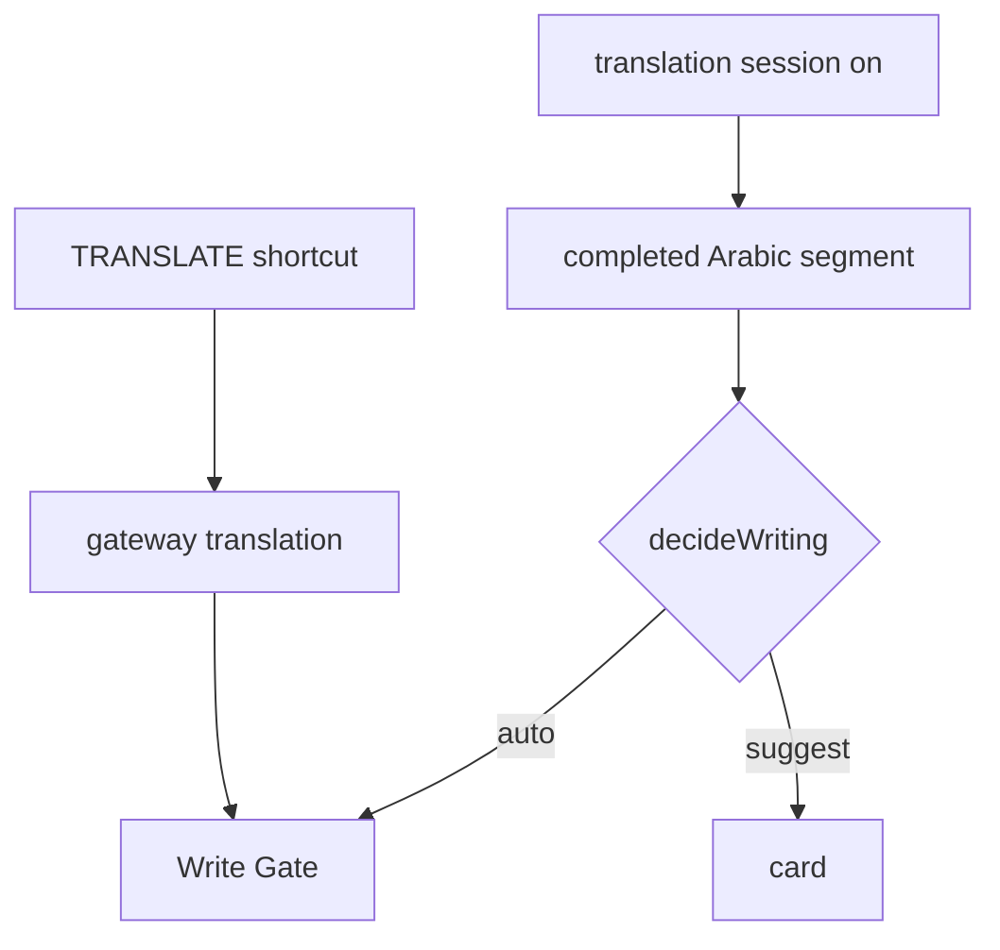

# Capabilities

## 1. Keyboard / layout repair

- **Activate:** Latin that maps to Arabic (or reverse) with sequence evidence; policy `fixWrongTyping`.
- **Evidence:** `mapLayout`, lexicons, neighbor agreement — not a sentence dictionary.
- **Auto:** unique low-risk span, helpStyle auto, not mixed-intent, not paste/open token.
- **Suggest / shortcut:** otherwise. `FIX_LAYOUT` and Speed Box layout mode.
- **Must abstain:** protected tokens, code editors, user override, structured CE auto-write.

## 2. English writing assistance

- **Activate:** `improveEnglish`. Instant lexicon (`dont` → `don't`) in the local cycle. Writing Review after completed English island.
- **Auto:** high-confidence spelling/grammar/punctuation on monolingual English island + helpStyle auto.
- **Suggest / shortcut:** suggestions mode; `CORRECT` uses instant then review ingest (no whole-field rewrite).
- **Must abstain:** mixed non-island, Arabizi, layout conflict, secrets, shortcuts_only.

## 3. Translation

- **Activate:** `arabicToEnglishMode` plus a translation **session** for live; shortcut `TRANSLATE` for selection/field.
- **Auto:** completed Arabic segment, session on, helpStyle auto.
- **Must abstain:** mixed blob translate, no session, polish of translated English unless `polishAfterTranslate`.
- **Protection:** translated ranges tagged so layout/English do not immediately fight the output.

## Interaction

`decideWriting` picks **one** action. Layout uniqueness blocks English on the same span. Review must not remap Arabic. Speed Box is explicit and isolated (`manual_box`).
